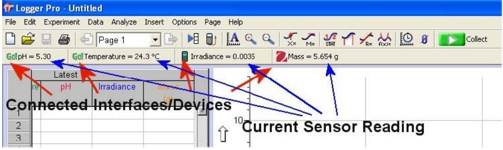

(appA)=
# Appendix A: Capstone data acquisition software:

#### Before launching, you should:

- Power the LabPro using the AC power supply or AA batteries.
- Connect a sensor to LabPro.
- Connect the USB or serial cable to LabPro.
- Attach the other end of the interface cable to any unused serial port or USB port on your computer.

## Start Logger *Pro*

Locate the Logger *Pro* icon and double‐click on it.

Logger *Pro* can collect data from multiple interfaces and devices.

*In the figure above, a Go!Link, Go!Temp, LabPro and Ohaus balance are connected to the computer.* Logger *Pro* is a program that allows you to collect and analyze data from Vernier LabPro. Among its many features, data may be manually entered from the keyboard, pasted from the clipboard, or retrieved from a file saved on disk. Logger *Pro* is also a document creator, with the ability to include several pages in one document.

With Logger *Pro* you can also:

- Perform data analysis, such as statistical analysis, curve fitting, and calculated columns.
- Add pictures to lab reports.
- Add movies and synchronize movies with data collection.
- Manually enter data.
- Export data to Excel® or other spreadsheets.
- Have students draw a prediction on a graph and see how well the experimental data matches it.

# AcquiringData

# Configure Logger** *Pro* **for Your Experiment

There are several ways to set up Logger *Pro* for an experiment. Most often you will just start Logger *Pro* with auto‐ID Sensors connected.

- **Auto‐ID Sensors** With auto‐ID sensors, all you need to do is connect the sensor to one of the LabPro channels and start Logger *Pro* software. The sensor will be identified, and default data‐collection parameters loaded for that sensor. You are ready to click the button and begin data collection!
- **Probes & sensors experiment files** If you are using an older Vernier sensor that is not auto‐ID, or if you want to use some other specially configured file, you will need the Probes & Sensors folder. Choose Open from the File menu, and open the Probes & Sensor folder. There you will find a folder for each of the Vernier sensors. Open up a file with a name that best fits the data collection you want to perform.

| • Sensor dialog |  |  |
|--------------------|--|--|
|                    |  |  |
|                    |  |  |
|                    |  |  |
|                    |  |  |
|                    |  |  |
|                    |  |  |
|                    |  |  |

This dialog, called up by clicking the LabPro icon in the upper left side. It shows your sensor information, the units and current readings. The details of the dialog vary, depending on the specific interface used. Use the scroll bars in the Sensor Catalogs to view all sensors.

By clicking in a Channel box with a displayed sensor, you may be able to:

- **Calibrate a sensor:** Perform a new calibration.
- **Get sensor information:** Includes collection details and calibration information
- **Zero a sensor:** Sets the current reading of a sensor to zero.
- **Choose sensor:** Select another sensor for the channel.
- **Change the current settings:** Select the available units or calibration settings.
- **Analog out (CH 4 only):** This channel can be used as a function generator.
- **Remove sensor:** Clears the channel of the sensor.

# Collect Data

Click the green GO button. Logger *Pro* will begin plotting data in the graph window. Tip: Normally, the data collection stops at the time indicated on the time axis. You can stop the data collection early by clicking the stop button. If you discover you want the data collection to go even longer, you can add additional time by choosing Extend Collection from the Experiment menu.

*Now that you have collected data, there are many things you can do with it. Keep reading for descriptions of some of the most commonly‐used Logger Pro features.*

# Store Data

The Store Latest Run option in the Experiment menu saves the most recently collected data in memory, allowing you to do another collection while keeping the first one.

The run labeled "Latest" always contains the most recently collected data, and is overwritten when you collect more data. When you store the latest run, a new data set named Run 1, Run 2, etc, is created and the values of the latest data set are copied to it. Columns in the latest data set are drawn with thick lines on the graph, while other columns are drawn with thin lines.

*Note: Using Store Latest Run does not save data on disk, nor will it preserve your data between sessions or when you turn off your computer. You must select Save As from the File menu to save your session (data and analysis) to disk.*

#### Data Collection and Modes

You are not limited to time‐based data collection. Choose Data Collection from the Experiment menu to modify data collection parameters for your experiment. See Logger *Pro*'s Help for information about your choices.

- **Time Based** Set the data collection rate as a function of time.
- **Events With Entry** A data point is recorded whenever the Keep button is clicked. You are then prompted to enter values for a new data column.
- **Selected Events** A data point is recorded whenever the Keep button is clicked.
- **Digital Events** You can set data collection to run continuously (until the Stop button is clicked) or at a certain number of events.

# Manually Enter Data

You can type data directly into the data table from the keyboard. To manually enter data, disconnect all interfaces, and start Logger *Pro*. Click on a cell and type in a number. You can use the mouse or the Enter/Return key to move and edit within the table. Your values will also be plotted on the graph.

# Logger** *Pro* **Screen and Toolbar

**Toolbar** The toolbar contains buttons for the most commonly used features of Logger *Pro*. All of the features in the toolbar are also available in the menus. As you move the pointer across a button, you are given a short description of each feature.

|  | DEDBBB2:Testing JBHBBAQQXXXXXXXXX |  |
|--|-----------------------------------|--|
|--|-----------------------------------|--|

**Menu bar** Logger *Pro* has a menu bar across the top of the main window. Use the menu bar to access all of the software's features.

|  |  | File Edit Experiment Data Analyze Insert Options Page Help |  |  |  |  |  |  |
|--|--|------------------------------------------------------------|--|--|--|--|--|--|
|--|--|------------------------------------------------------------|--|--|--|--|--|--|

| Click                                             | To                                                                        |  |  |  |
|---------------------------------------------------|---------------------------------------------------------------------------|--|--|--|
|                                                   | Create a new document.                                                    |  |  |  |
| B                                                 | Open an existing document.                                                |  |  |  |
| ۳                                                 | Save the active document or template with its current name.               |  |  |  |
| ā                                                 | Print the screen as displayed on your monitor.                            |  |  |  |
| 1: letra L Intro <u>Testin</u> Candusian | Scroll between pages.                                                     |  |  |  |
| ₽                                                 | Bring up the previous page of the current document.                       |  |  |  |
| ъ                                                 | Bring up the next page of the current document.                           |  |  |  |
| 相                                                 | Bring up the Data Browser Window.                                         |  |  |  |
| Ū.                                                | Import data from the Texas Instruments calculator.                        |  |  |  |
| IA.                                               | Automatically scale the graph to include all data points.                 |  |  |  |
| $^{\circ}$                                        | Zoom in to the selected region of the graph.                              |  |  |  |
| Q                                                 | Zoom out by a factor of two in both x- and y-directions.                  |  |  |  |
| $\frac{1}{\lambda_{1}}$                           | Enter Examine mode.                                                       |  |  |  |
| Z                                                 | Enter Tangent Line mode.                                                  |  |  |  |
| ٢Ī                                                | Integrate selected data range.                                            |  |  |  |
| 綺                                                 | Calculate statistics on selected data.                                    |  |  |  |
| ↙                                                 | Make a linear fit to the selected range.                                  |  |  |  |
| 씂                                                 | Perform general curve fits.                                               |  |  |  |
| 19                                                | Set data-collection parameters.                                           |  |  |  |
| ×                                                 | Begin collecting data.                                                    |  |  |  |
|                                                   | (The following icons only appear when collecting data or if is relevant.) |  |  |  |
| Ξ                                                 | Stops collecting data or stops a replay.                                  |  |  |  |
| ∗                                                 | Tells the heat pulser to generate a pulse.                                |  |  |  |
| Ø                                                 | Click this button to keep a data point.                                   |  |  |  |
| ◉                                                 | Click the Zero button to set the current value of a sensor to zero.       |  |  |  |
| Ø                                                 | Create a new Graph Match.                                                 |  |  |  |

#### Manage Your Page and** D**ata

There are numerous ways that you can customize the presentation of your data.

**Move Objects** Select the object by clicking on it once. Move the cursor over the edge of the selected object until the cursor turns into a hand, then hold down the mouse button while grabbing and moving the object.

**Resize Objects** Single‐click on an object to select it. When an object is selected, its border becomes visible, along with eight resizing handles.

Clicking and dragging a resize handle will resize the object in the appropriate direction.

**Graph Axes** Customize your graph by changing the columns that are displayed.

1. Position the mouse over the X‐axis or Y‐axis label and click. A list of available columns will appear.

2. Select the column you want displayed. If you want more than one column displayed, select More and check the boxes next to the desired columns.

**Graph Options** Double‐click on the graph or select Graph Options from the Options menu to call up the Graph Options dialog. This allows you to change the graph object appearance, including point protectors, legend, line style, and other graph features. Click the Axis Options Tab to adjust scaling and select what columns are plotted or add a Y axis to the right‐hand side of the graph.

#### C**reate a** C**olumn**

You can create a new column that is manually entered or that consists of calculations based on other data in Logger *Pro*. Create a new column by selecting New Manual Column or New Calculated Column from the Data menu.

| $\overline{\mathbf{x}}$ New Calculated Column                                     |
|--------------------------------------------------------------------------------------|
| Column Definition   Options                                                          |
| - Labels and Units: -                                                                |
| $\blacktriangledown$ Name: First Derivative pH                                    |
| Units: mL-1 Short Name: d pH                                                      |
| Destination: M Add to All Similar Data Sets Data Set: Latest $\mathbf{v}$   |
| Equation:                                                                            |
| derivative("pH","Volume")                                                            |
| Variables (Columns) > Functions > Parameters > Display during Live Readouts |
| Done Cancel Help                                                               |

#### S**elect and** E**dit** C**ells in a** D**ata** T**able**

Manually‐entered data and data collected using the Events with Entry mode can be edited.

- To edit a single cell in a table, single‐click in the cell.
- To select a single cell in a table, click and drag the selection within that cell.
- You can select entire columns by clicking on the title of the column.
- You can select an entire row of data by clicking on the row numbers.

## T**he** D**ata Browser**

The Data Browser is a container for all data in a Logger *Pro* file. In contrast, a given Data Table will not necessarily show all data columns.

# Data Browser Features

Drag and drop from the Data Browser to objects such as tables and graphs. Drag a column to a y‐ or x‐axis to plot it there.

When the Data Browser is selected, edit menu items like Cut, Copy, Paste, etc. will apply to the selected items within the Data Browser.

# Analyze** D**ata

The Analyze menu contains functions for examining and analyzing your data. A few of the most commonly used analysis functions include:

- **Examine:** Shows the x‐ and y‐values of the data point closest to the mouse pointer.
- **Statistics:** Calculates the minimum, maximum, mean, and standard deviation.
- **Curve Fit:** Fits a selected or user‐defined function over the data.
- **Draw Prediction:** Sketch a prediction on a graph using the mouse.

Several of the analysis features are available from the Toolbar.

# Additional** A**nalysis** F**eatures

**Movie:** You can synchronize data collection and a movie of the experiment so that as you Replay the movie, the data are replayed on the graph.

**Video Analysis:** You can create a graphical representation of the motion you see in a movie. **Model:** Perform a manual curve fit of your data.

**Histogram:** Displays the distribution of values for a data set in bar graph format.

**Strip Chart:** Each new collected data point gets added to the right most edge of the graph.

**FFT:** Gives the amplitudes of the frequency components of a data series, and displays a bar graph showing the amplitudes of the frequencies shown along the x‐axis.

# Set Preferences

The Preferences dialog box contains several options that pertain to the general operation of the software. These preferences will apply every time Logger *Pro* is launched.

In Windows, choose Preferences from the File menu. In Mac OS X, choose Preferences from the Logger *Pro* menu.

# Printing

Print Graphs and Data

1. Arrange the objects on the screen as you want them to appear on the paper. If you choose, you can print several graphs and data tables at once.

2. Select Print from the File menu or click on the toolbar.

3. When the printer is ready, click in the Print dialog box.

You can print the graphs and data tables individually by selecting Print Graph or Print Data Table from the File menu.

# Where to Next?

The extensive Help system in Logger *Pro* provides detailed instructions for these and other features.

Also available are the Logger *Pro* Tutorials. Choose Open from the File menu to access them. These short tutorials are suitable for reference or for use in your classes. First‐time users should work through one introductory tutorial and the advanced tutorials as needed.

If you have questions as you are using our software, call or e‐mail us. We will be happy to help!
