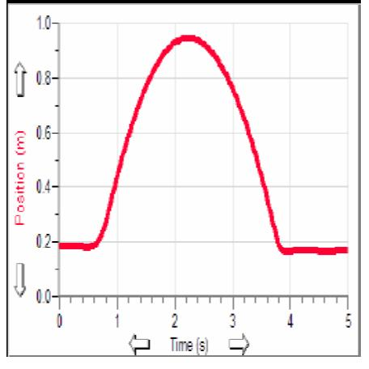
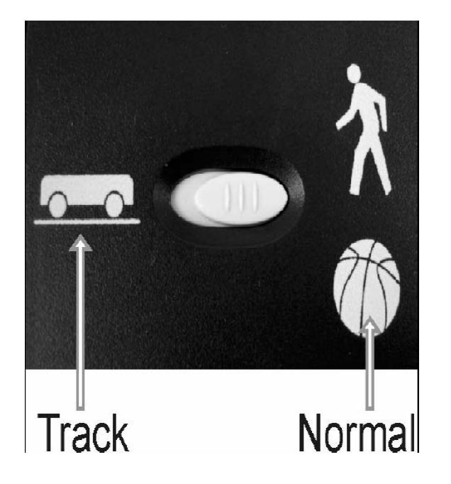

(appC)=
# Appendix C - Motion Detector

The Motion Detector is used to collect position, velocity and acceleration data of moving objects. Students can study a variety of motions with the Motion Detector.

This is a sample of motion data collected with Capstone and a computer.

# How the Motion Detector Works

This Motion Detector emits short bursts of ultrasonic sound waves from the gold foil of the transducer. These waves fill a cone-shaped area about 15 to 20° off the axis of the centerline of the beam. The Motion Detector then "listens" for the echo of these ultrasonic waves returning to it. The equipment measures how long it takes for the ultrasonic waves to make the trip from the Motion Detector to an object and back. Using this time and the speed of sound in air, the distance to the nearest object is determined.

Note that the Motion Detector will report the distance to the closest object that produces a sufficiently strong echo. The Motion Detector can pick up objects such as chairs and tables in the cone of ultrasound. The sensitivity of the echo detection circuitry automatically increases, in steps, every few milliseconds as the ultrasound travels out and back. This is to allow for echoes being weaker from distant objects.

#### Features of the Motion Detector

- The Motion Detector is capable of measuring objects as close as 0.15 m and as far away as 6 m. The short minimum target distance (new to this version of the Motion Detector) allows objects to get close to the detector, which reduces stray reflections.
- The Motion Detector has a pivoting head, which helps you aim the sensor accurately. For example, if you wanted to measure the motion of a small toy car on an inclined plane, you can lay the Motion Detector on its back and pivot the Motion Detector head so that it is perpendicular to the plane.
- The Motion Detector has a Sensitivity Switch, which is located under the pivoting Motion Detector head. To access it, simply rotate the detector head away from the detector body.

#### Connecting the Motion Detector to a Capstone Interface

To use the Motion Detector with LabPro, the Motion Detector is connected to the computer by bluetooth. 

#### Using the Sensitivity Switch

Slide the Sensitivity Switch to the right to set the switch to the "normal" setting. This setting is best used for experiments such as studying the motion of a person walking back and forth in front of the Motion Detector, a ball being tossed in the air, pendulum motion, and any other motion involving relatively large distances or with objects that are poor reflectors, e.g., coffee filters. The other sensitivity setting, which we call "Track", works well when studying motion of carts on tracks like the Vernier Dynamics System, or motions in which you want to eliminate stray reflections from object near to the sensor beam.

