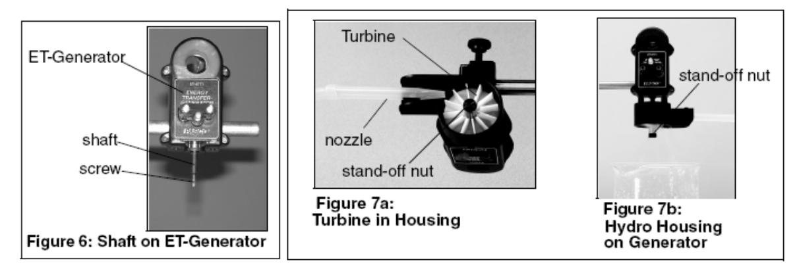
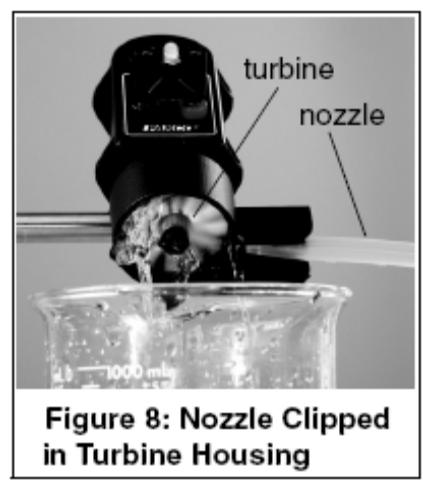
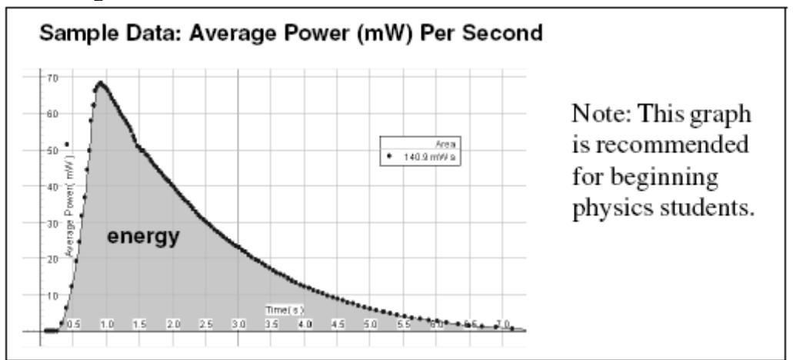
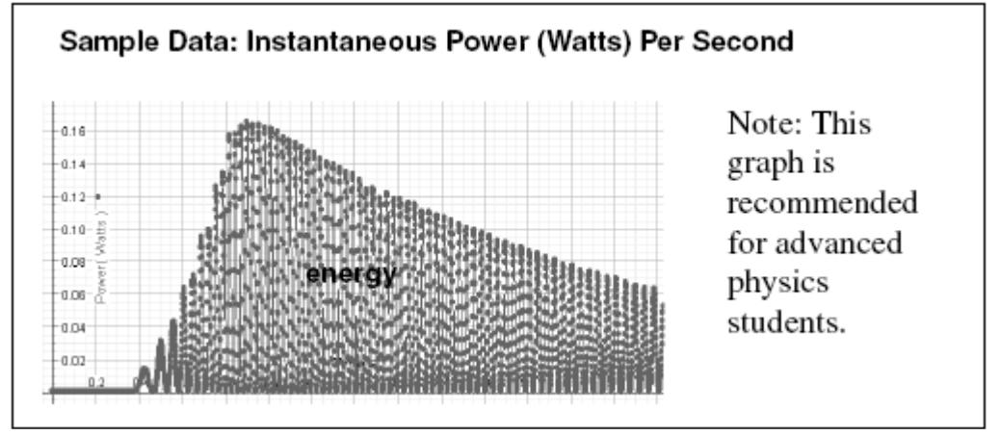

(appF)=
# Appendix E - The Energy Transfer Generator

Used for demonstrating the conversion of stored gravitational potential energy into electrical energy. The generator includes a 3/4 inch neodymium magnet, which spins between two 400 turn coils, and is visible inside a semi-clear, plastic housing. A plastic rod clamp is molded to the generator for attaching the housing to a rod stand. Two plug attachments, an LED (light emitting diode) plug and 100 ohm resistor plug are included. Both the LED and resistor plug insert into the banana jack outputs on the generator's housing. Each plug contains two jacks for connecting a voltage sensor to the generator for collecting data with a computer. The LED plug allows the user to visually see the electrical effects of turning the shaft on the generator. As the student rotates the generator, the LED emits light. The resistor plug is recommended for use with sensors, so the student can measure the effects of generator rotation on power, voltage, and energy. A three‐step pulley keys into the shaft on the side of the housing and is removable.

### Basic Setup

**Note: The basic setup uses a pulley and hanging mass. There are hydro and wind accessories that require some setup.**

# Attaching a Pulley with Hanging Mass to the ET-Generator

1. Use the rod clamp on the side of the ET-Generator to mount the generator to a rod stand.
2. Insert the LED plug into the jacks on the generator [](#fig:appF:Generator).

```{figure} ../figures/appF/Pascogenerator.svg
:label: fig:appF:Generator
:width: 100%
:align: center
:alt: The Pasco ET-Generator with relevant parts labeled.
The Pasco ET-Generator with relevant parts labeled.
```

3. To attach the pulley, align the indent marks on the pulley with the indented portion of the black shaft on the generator; then slide the pulley onto the shaft. Fasten the nut tight over the screw to hold the pulley in place.
4. Cut a small piece of no‐bounce foam, and place the foam underneath the hanging mass (Figure 1b).
5. Cut a piece of string to tie to the hanging mass and pulley (Figure 1b).
6. Tie a double knot in the string and hook

the knot in the slot on the pulley.

## Collecting Data with the ET-Generator

**Note: For real-time data collection, a computer interface is required.**

1. Insert the resistor plug into the jacks on the generator. **Note: For electrical studies, use the resistor plug and a Voltage Probe.**
2. Connect a Voltage Probe to the LabPro interface
3. With the Voltage Probe, connect the black banana plug to the black jack and red banana plug to the red jack on the ET-Generator.
4. Setup your experiment in Capstone.
5. In Capstone, click the **Start** button. Let the mass fall, and record the power or other measurement.

# Attaching the ET-Hydro Accessory (ET-8772) to the ET-Generator

1. Attach the ET-Hydro Accessory housing to the molded case of the ET-Generator using the two captured screws and the supplied screwdriver (Figures 6-7)



2. Attach the turbine blade and tighten the standoff nut over the shaft screw. Keep your fingers in the recess of the housing and hold the shaft to keep the turbine from spinning (Figure 7a).
3. Insert the pointed end of a plastic nozzle into the spring clip underneath the housing (Figure 7a). **Note:** The clip is spring-loaded and can turn to adjust where the water stream hits the turbine. To increase the water flow, cut (trim) the nozzle end.
4. Connect the nozzle to a piece of tubing connected to an external water supply. **Note:**  Have a beaker or container below the housing to collect water exiting the turbine.
5. Run the water supply through the nozzle of the turbine and watch the turbine spin. **Note:** To collect data, insert the 100 ohm resistor plug into the banana jacks, connect banana plugs from a Voltage Probe into the resistor plug, and click the **Start** button in Capstone. when water is running through.



#### Sample Results

a) This graph is of average power, and for each turn of the magnet, it shows the average power generated for that small time. The area under the curve is energy (notice almost the same value as the energy for instantaneous power) but should be easier to comprehend for the beginner.



b) The graph below is the actual instantaneous power, and the area under the curve is energy. For beginning students, this graph would be hard to understand. They might ask, why is it going up and down?



