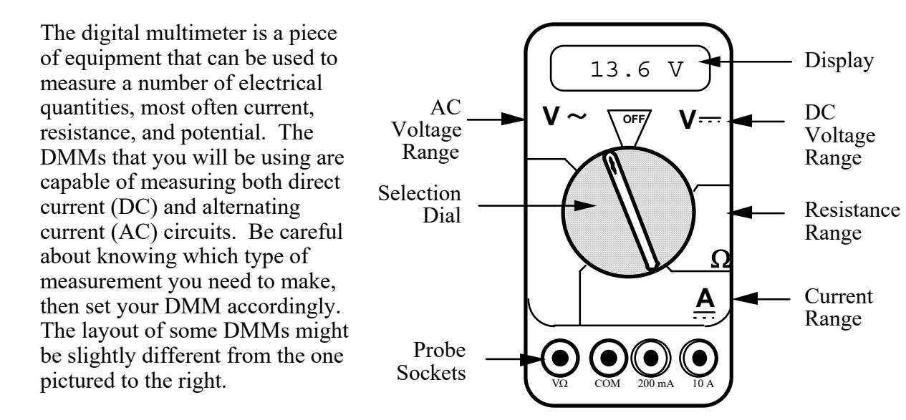
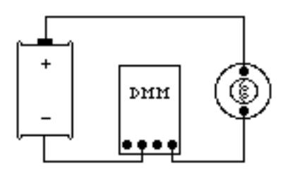
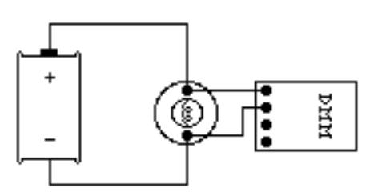
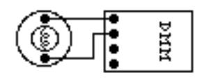

(appG)=
# Appendix G - The Digital Multimeter (DMM)

The digital multimeter is a piece of equipment that can be used to
measure a number of electrical quantities, most often current,
resistance, and potential. The DMMs that you will be using are capable of measuring both direct current (DC) and alternating
current (AC) circuits. Be careful about knowing which type of
measurement you need to make, then set your DMM accordingly.
The layout of some DMMs might be slightly different from the one
pictured to the right.

*The DMM can measure currents from 10 amps to one microamp (10–6 amps). This versatility makes the DMM fragile, since measuring a large current while the DMM is prepared to measure a small one will certainly harm the DMM. For instance, measuring a 1-ampere current while the DMM is on the 2-milliamp scale will blow a fuse. If this happens, the TA may be able to change the fuse. However, if you damage the DMM beyond repair, you will have to finish the lab without it.* 

# Measuring Current:

- **1.** Set the selection dial of the DMM to the highest current measurement setting (10 amps). Insert one wire into the socket labeled "10A" and a second wire into the socket labeled "COM."
- **2.** Attach the DMM into the circuit as shown below:

 To measure current, the DMM must be placed in the circuit so that all the current you want to measure goes **through** the DMM.

- **3.** If no number appears while the DMM is at the 10A setting, move the wire from the 10A socket to the 200mA socket and then turn the selection dial to the 200 milliamp (200m) setting. If there is still no reading, change the dial to the 20 milliamp setting, etc.
- **4.** When you have taken your measurement, return the DMM selection dial to the highest current setting (10 amps) and move the wire back to the 10 A socket.

# Measuring Voltage:

- **1.** Set the DMM selection dial to read DC volts. Insert one wire into the socket labeled 'V?' and a second wire into the socket labeled 'COM'.
- **2.** Set the selection dial of the DMM to the highest voltage measurement setting. Connect the two wires from the DMM to the two points between which you want to measure the voltage, as shown below.

 To measure voltage, the DMM must be placed in a circuit so that the potential difference across the circuit element you want to measure is across the DMM.

**3.** If no number appears, try a different measurement scale. Start at the highest voltage scale and work your way down the scales until you get a reading.

# Measuring Resistance:

The component whose resistance you are measuring must be disconnected from all other currents (due to other batteries, power supplies, etc.) for the DMM to work. That means you must remove it from a circuit first.

- **1.** Set the DMM selection dial to measure ohms (Ω). Insert one wire into the socket labeled 'VΩ' and a second wire into the socket labeled 'COM'.
- **2.** Make sure that the circuit element whose resistance you wish to measure is free of any currents.
- **3.** Attach the wires across the circuit element, as shown in the example below:

**4.** If no number appears, try a different scale. Use a method that covers all the scales, such as beginning at the largest scale (20 MΩ) and working your way down.
