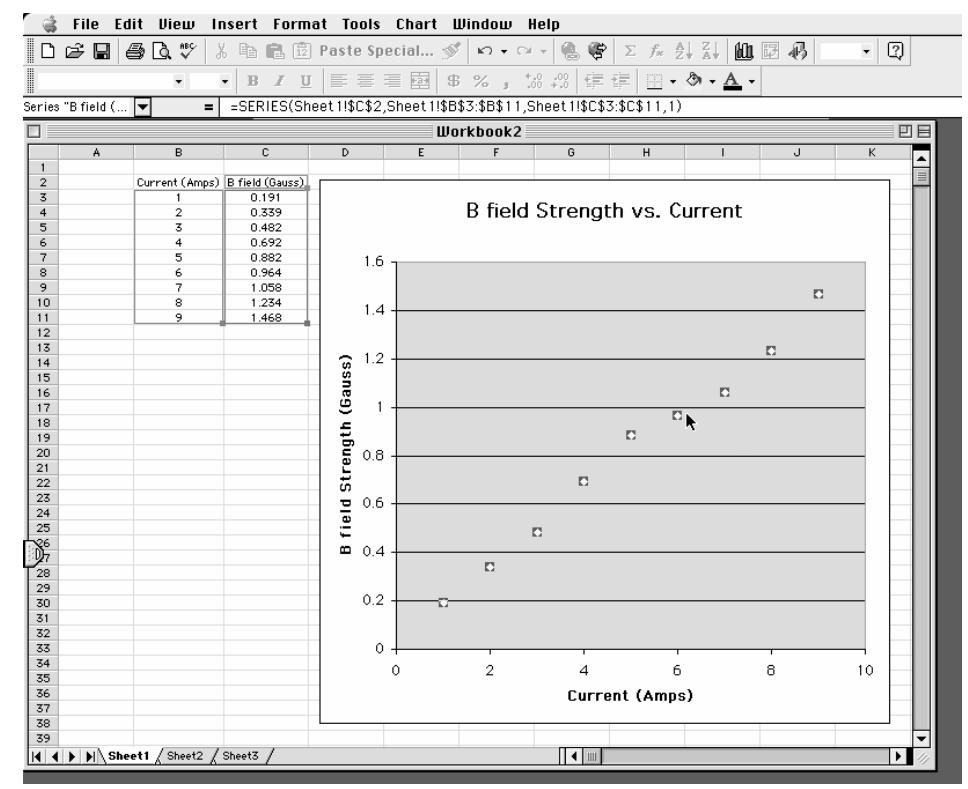

(appH)=
# Appendix G – Graphing with Microsoft Excel

You will find that numerous exercises in this manual will require graphs. Microsoft Excel is a spreadsheet program that can create fourteen types of graphs, each of which have from two to ten different formats. This results in a maze of possibilities. There are help screens in Excel; however, this overview is covers the type of graph you should include in your lab reports. This is meant to be a brief introduction to the use of Microsoft Excel for graphing scientific data. If you are acquainted with Excel already, you should still skim through this appendix to learn about the type of graph to include in reports.

Microsoft Excel is available to all students on the computers in the University labs:

| East Bank: | Eddy Hall Annex 54 Elliott Hall 121 Folwell Hall 14 Walter Library 103                         |
|------------|---------------------------------------------------------------------------------------------------------|
| West Bank: | HHH Center 50                                                                                           |
| St. Paul:  | Classroom Office Building 135 Classroom Office Building 17 Magrath Library B50 McNeal Hall 305 |

**Step 1. Input your measurements and highlight the data using your cursor.** 

| ſå                                                                                    |    | File Edit View Insert Format Tools Data Window Help                                                                                                            |                                |                |   |           |                |   |                                                                         |   |                               |
|---------------------------------------------------------------------------------------|----|----------------------------------------------------------------------------------------------------------------------------------------------------------------|--------------------------------|----------------|---|-----------|----------------|---|-------------------------------------------------------------------------|---|-------------------------------|
|                                                                                       |    | $\boxed{\begin{array}{ c c c }\hline \multicolumn{3}{ c }{\text{D}} \text{ } \text{ } \text{ } \text{ } \text{ } \text{ } \text{ } \text{ } \text{ } \text{ }$ |                                |                |   |           |                |   | ※ 暭 區 ② Paste Special ♂   ∽ ← ∞ - │ ● ☞ │ ∑ ∱ 是↓ 김 │ 仙 図 仍 │ 100% - │ ② |   |                               |
| $\sqrt{\frac{1}{2}}$ Geneva                                                           |    | $-9$                                                                                                                                                           | ▼BIU                           |                |   |           |                |   |                                                                         |   |                               |
|                                                                                       | B2 | ।च                                                                                                                                                             | $=$ Current (Amps)             |                |   |           |                |   |                                                                         |   |                               |
| $\Box$                                                                                |    |                                                                                                                                                                |                                |                |   | Workbook2 |                |   |                                                                         |   | 凹目                            |
| $\overline{1}$                                                                        | A  | в                                                                                                                                                              | $\mathbf{c}$                   | $\overline{D}$ | E | F         | G              | H |                                                                         | J | К $\overline{\phantom{a}}$ |
| $\mathbf{2}$                                                                          |    |                                                                                                                                                                | Current (Amps) B field (Gauss) |                |   |           |                |   |                                                                         |   | $\equiv$                      |
| $\frac{3}{4}$ $\frac{4}{5}$ $\frac{5}{6}$ $\frac{6}{7}$ $\frac{7}{10}$ $\frac{8}{11}$ |    |                                                                                                                                                                | 0.191                          |                |   |           |                |   |                                                                         |   |                               |
|                                                                                       |    | $\overline{2}$                                                                                                                                                 | 0.339                          |                |   |           |                |   |                                                                         |   |                               |
|                                                                                       |    | $\overline{5}$                                                                                                                                                 | 0.482 0.692                 |                |   |           |                |   |                                                                         |   |                               |
|                                                                                       |    |                                                                                                                                                                | 0.882                          |                |   |           |                |   |                                                                         |   |                               |
|                                                                                       |    | 6                                                                                                                                                              | 0.964                          |                |   |           |                |   |                                                                         |   |                               |
|                                                                                       |    |                                                                                                                                                                | 1.058                          |                |   |           |                |   |                                                                         |   |                               |
|                                                                                       |    | 8                                                                                                                                                              | 1.234                          |                |   |           |                |   |                                                                         |   |                               |
|                                                                                       |    | 9                                                                                                                                                              | 1.468                          |                |   |           |                |   |                                                                         |   |                               |
| $\overline{12}$ 13                                                                 |    |                                                                                                                                                                |                                | Ф              |   |           |                |   |                                                                         |   |                               |
| 14                                                                                    |    |                                                                                                                                                                |                                |                |   |           |                |   |                                                                         |   |                               |
| 15                                                                                    |    |                                                                                                                                                                |                                |                |   |           |                |   |                                                                         |   |                               |
| 16                                                                                    |    |                                                                                                                                                                |                                |                |   |           |                |   |                                                                         |   |                               |
| 17                                                                                    |    |                                                                                                                                                                |                                |                |   |           |                |   |                                                                         |   |                               |
| 18                                                                                    |    |                                                                                                                                                                |                                |                |   |           |                |   |                                                                         |   |                               |
| 19                                                                                    |    |                                                                                                                                                                |                                |                |   |           |                |   |                                                                         |   |                               |
| 20                                                                                    |    |                                                                                                                                                                |                                |                |   |           |                |   |                                                                         |   |                               |
| 21 22                                                                              |    |                                                                                                                                                                |                                |                |   |           |                |   |                                                                         |   |                               |
| 23                                                                                    |    |                                                                                                                                                                |                                |                |   |           |                |   |                                                                         |   |                               |
| 24                                                                                    |    |                                                                                                                                                                |                                |                |   |           |                |   |                                                                         |   |                               |
| 25                                                                                    |    |                                                                                                                                                                |                                |                |   |           |                |   |                                                                         |   |                               |
| $\frac{86}{28}$                                                                       |    |                                                                                                                                                                |                                |                |   |           |                |   |                                                                         |   |                               |
|                                                                                       |    |                                                                                                                                                                |                                |                |   |           |                |   |                                                                         |   |                               |
|                                                                                       |    |                                                                                                                                                                |                                |                |   |           |                |   |                                                                         |   |                               |
| 29 30                                                                              |    |                                                                                                                                                                |                                |                |   |           |                |   |                                                                         |   |                               |
| 31                                                                                    |    |                                                                                                                                                                |                                |                |   |           |                |   |                                                                         |   |                               |
| 32                                                                                    |    |                                                                                                                                                                |                                |                |   |           |                |   |                                                                         |   |                               |
| 33                                                                                    |    |                                                                                                                                                                |                                |                |   |           |                |   |                                                                         |   |                               |
| 34                                                                                    |    |                                                                                                                                                                |                                |                |   |           |                |   |                                                                         |   |                               |
| 35                                                                                    |    |                                                                                                                                                                |                                |                |   |           |                |   |                                                                         |   |                               |
| 36                                                                                    |    |                                                                                                                                                                |                                |                |   |           |                |   |                                                                         |   |                               |
| 37                                                                                    |    |                                                                                                                                                                |                                |                |   |           |                |   |                                                                         |   |                               |
| 38                                                                                    |    |                                                                                                                                                                |                                |                |   |           |                |   |                                                                         |   |                               |
| 39                                                                                    |    |                                                                                                                                                                |                                |                |   |           |                |   |                                                                         |   |                               |
|                                                                                       |    | II I         Sheet1 / Sheet2 / Sheet3 /                                                                                                                        |                                |                |   |           | $\blacksquare$ |   |                                                                         |   |                               |

#### Step 2. Click on the "Chart Wizard" on the toolbar.

#### Step 3.

**Choose XY Scatter, not Line, from the list and click the "Next" button.** 

#### "Series in: Columns" option and click the "Next" button.

| r a≧                                      | File Edit View Insert Format Tools Data Window Help                                                                                                                                                                                                                                                                                                                                                                       |                    |   |               |                          |    |                                         |        |   |        |                                             |        |   |                             |                       |   |
|-------------------------------------------|---------------------------------------------------------------------------------------------------------------------------------------------------------------------------------------------------------------------------------------------------------------------------------------------------------------------------------------------------------------------------------------------------------------------------|--------------------|---|---------------|--------------------------|----|-----------------------------------------|--------|---|--------|---------------------------------------------|--------|---|-----------------------------|-----------------------|---|
|                                           |                                                                                                                                                                                                                                                                                                                                                                                                                           |                    |   |               |                          |    |                                         |        |   |        |                                             |        |   |                             |                       |   |
|                                           | $\fbox{\hskip5pt{12pt} \hbox{$\bullet$} \hbox{\hskip5pt{12pt} \hbox{$\bullet$} \hbox{\hskip5pt{12pt} \hbox{$\bullet$} \hbox{\hskip5pt{12pt} \hbox{$\bullet$} \hbox{\hskip5pt{12pt} \hbox{$\bullet$} \hbox{\hskip5pt{12pt} \hbox{$\bullet$} \hbox{\hskip5pt{12pt} \hbox{$\bullet$} \hbox{\hskip5pt{12pt} \hbox{$\bullet$} \hbox{\hskip5pt{12pt} \hbox{$\bullet$} \hbox{\hskip5pt{12pt} \hbox{$\bullet$} \hbox{\hskip5pt{1$ |                    |   |               |                          |    |                                         |        |   |        |                                             |        |   |                             |                       |   |
|                                           | च                                                                                                                                                                                                                                                                                                                                                                                                                         | $=$ Current (Amps) |   |               |                          |    |                                         |        |   |        |                                             |        |   |                             |                       |   |
|                                           |                                                                                                                                                                                                                                                                                                                                                                                                                           |                    |   |               | Workbook2                |    |                                         |        |   |        |                                             |        |   |                             |                       |   |
| A                                         | B                                                                                                                                                                                                                                                                                                                                                                                                                         | $\mathbf{c}$       | D | E.            | F.                       | G. |                                         |        | H |        |                                             |        | J |                             | K                     | ▲ |
| $\overline{1}$                            |                                                                                                                                                                                                                                                                                                                                                                                                                           |                    |   |               |                          |    |                                         |        |   |        |                                             |        |   |                             |                       |   |
| $\frac{2}{3}$ $\frac{4}{5}$ $\frac{6}{7}$ | Current (Amps) B field (Gauss)                                                                                                                                                                                                                                                                                                                                                                                            |                    |   |               |                          |    |                                         |        |   |        |                                             |        |   |                             |                       |   |
|                                           |                                                                                                                                                                                                                                                                                                                                                                                                                           | 0.191              |   |               |                          |    |                                         |        |   |        |                                             |        |   |                             |                       |   |
|                                           | $\overline{2}$ 3                                                                                                                                                                                                                                                                                                                                                                                                       | 0.339 0.482     |   |               |                          |    |                                         |        |   |        |                                             |        |   |                             |                       |   |
|                                           | 4                                                                                                                                                                                                                                                                                                                                                                                                                         |                    |   |               |                          |    |                                         |        |   |        |                                             |        |   |                             |                       |   |
|                                           | 5                                                                                                                                                                                                                                                                                                                                                                                                                         | 0.692 0.882     |   |               |                          |    |                                         |        |   |        |                                             |        |   |                             |                       |   |
| $\frac{1}{8}$                             |                                                                                                                                                                                                                                                                                                                                                                                                                           | 0.964              |   |               |                          |    |                                         |        |   |        |                                             |        |   |                             |                       |   |
|                                           | 7                                                                                                                                                                                                                                                                                                                                                                                                                         | 1.058              |   |               |                          |    |                                         |        |   |        |                                             |        |   |                             |                       |   |
| $\frac{9}{10}$                            | 8                                                                                                                                                                                                                                                                                                                                                                                                                         | 1.234              |   |               |                          |    |                                         |        |   |        |                                             |        |   |                             |                       |   |
| $\overline{11}$                           | 9                                                                                                                                                                                                                                                                                                                                                                                                                         | 1.468              |   |               |                          |    |                                         |        |   |        |                                             |        |   |                             |                       |   |
| $\overline{12}$                           |                                                                                                                                                                                                                                                                                                                                                                                                                           |                    |   |               |                          |    |                                         |        |   |        |                                             |        |   |                             |                       |   |
| 13                                        |                                                                                                                                                                                                                                                                                                                                                                                                                           |                    |   |               |                          |    |                                         |        |   |        |                                             |        |   |                             |                       |   |
| 14                                        |                                                                                                                                                                                                                                                                                                                                                                                                                           |                    |   |               |                          |    |                                         |        |   |        |                                             |        |   |                             |                       |   |
| 15                                        |                                                                                                                                                                                                                                                                                                                                                                                                                           |                    |   |               |                          |    |                                         |        |   |        |                                             |        |   |                             |                       |   |
| 16                                        |                                                                                                                                                                                                                                                                                                                                                                                                                           |                    |   |               |                          |    |                                         |        |   |        |                                             |        |   |                             |                       |   |
| 17                                        |                                                                                                                                                                                                                                                                                                                                                                                                                           |                    |   |               |                          |    |                                         |        |   |        |                                             |        |   |                             |                       |   |
| 18                                        |                                                                                                                                                                                                                                                                                                                                                                                                                           |                    |   |               |                          |    |                                         |        |   |        |                                             |        |   |                             |                       |   |
| 19                                        |                                                                                                                                                                                                                                                                                                                                                                                                                           |                    |   |               |                          |    |                                         |        |   |        |                                             |        |   |                             |                       |   |
| 20                                        |                                                                                                                                                                                                                                                                                                                                                                                                                           |                    |   |               |                          |    |                                         |        |   |        |                                             |        |   |                             |                       |   |
| 21                                        |                                                                                                                                                                                                                                                                                                                                                                                                                           |                    |   |               |                          |    |                                         |        |   |        |                                             |        |   |                             |                       |   |
| 22                                        |                                                                                                                                                                                                                                                                                                                                                                                                                           |                    |   |               |                          |    |                                         |        |   |        |                                             |        |   |                             |                       |   |
| 23                                        |                                                                                                                                                                                                                                                                                                                                                                                                                           |                    |   |               |                          |    |                                         |        |   |        | Chart Wizard - Step 4 of 4 - Chart Location |        |   |                             |                       |   |
| 24                                        |                                                                                                                                                                                                                                                                                                                                                                                                                           |                    |   |               |                          |    |                                         |        |   |        |                                             |        |   |                             |                       |   |
| 25                                        |                                                                                                                                                                                                                                                                                                                                                                                                                           |                    |   | Place chart:- |                          |    |                                         |        |   |        |                                             |        |   |                             |                       |   |
|                                           |                                                                                                                                                                                                                                                                                                                                                                                                                           |                    |   |               |                          |    |                                         |        |   |        |                                             |        |   |                             |                       |   |
| $\frac{1}{28}$                            |                                                                                                                                                                                                                                                                                                                                                                                                                           |                    |   |               |                          |    |                                         |        |   |        |                                             |        |   |                             |                       |   |
|                                           |                                                                                                                                                                                                                                                                                                                                                                                                                           |                    |   |               | $\bigcirc$ As new sheet: |    |                                         | Chart1 |   |        |                                             |        |   |                             |                       |   |
| 29                                        |                                                                                                                                                                                                                                                                                                                                                                                                                           |                    |   |               |                          |    |                                         |        |   |        |                                             |        |   |                             |                       |   |
| 30                                        |                                                                                                                                                                                                                                                                                                                                                                                                                           |                    |   |               |                          |    |                                         |        |   |        |                                             |        |   |                             |                       |   |
| 31                                        |                                                                                                                                                                                                                                                                                                                                                                                                                           |                    |   |               | As object in: Sheet1     |    |                                         |        |   |        |                                             |        |   | $\left  \bullet \right $    |                       |   |
| 32                                        |                                                                                                                                                                                                                                                                                                                                                                                                                           |                    |   |               |                          |    |                                         |        |   |        |                                             |        |   |                             |                       |   |
| 33                                        |                                                                                                                                                                                                                                                                                                                                                                                                                           |                    |   |               |                          |    |                                         |        |   |        |                                             |        |   |                             |                       |   |
| 34                                        |                                                                                                                                                                                                                                                                                                                                                                                                                           |                    |   |               |                          |    |                                         |        |   |        |                                             |        |   |                             |                       |   |
| 35                                        |                                                                                                                                                                                                                                                                                                                                                                                                                           |                    |   | $\boxed{2}$   |                          |    | Cancel                                  |        |   | < Back |                                             | Next > |   | $\sqrt{\frac{1}{2}}$ Finish |                       |   |
| 36                                        |                                                                                                                                                                                                                                                                                                                                                                                                                           |                    |   |               |                          |    |                                         |        |   |        |                                             |        |   |                             |                       |   |
| 37                                        |                                                                                                                                                                                                                                                                                                                                                                                                                           |                    |   |               |                          |    |                                         |        |   |        |                                             |        |   |                             |                       |   |
| 38                                        |                                                                                                                                                                                                                                                                                                                                                                                                                           |                    |   |               |                          |    |                                         |        |   |        |                                             |        |   |                             |                       |   |
| 39                                        |                                                                                                                                                                                                                                                                                                                                                                                                                           |                    |   |               |                          |    |                                         |        |   |        |                                             |        |   |                             |                       |   |
|                                           | I 4         Sheet1 / Sheet2 / Sheet3                                                                                                                                                                                                                                                                                                                                                                                      |                    |   |               |                          |    | $\vert \cdot \vert$ $\vert \cdot \vert$ |        |   |        |                                             |        |   |                             | $\blacktriangleright$ |   |
|                                           |                                                                                                                                                                                                                                                                                                                                                                                                                           |                    |   |               |                          |    |                                         |        |   |        |                                             |        |   |                             |                       |   |

#### them.

**Step 9. Select "Add a Trendline" from the "Chart" menu.** 

#### type of trend line for your data.

**Step 11. The trend line will appear – is it a good fit to your data?** 

#### needed, choose "Display equation on chart."