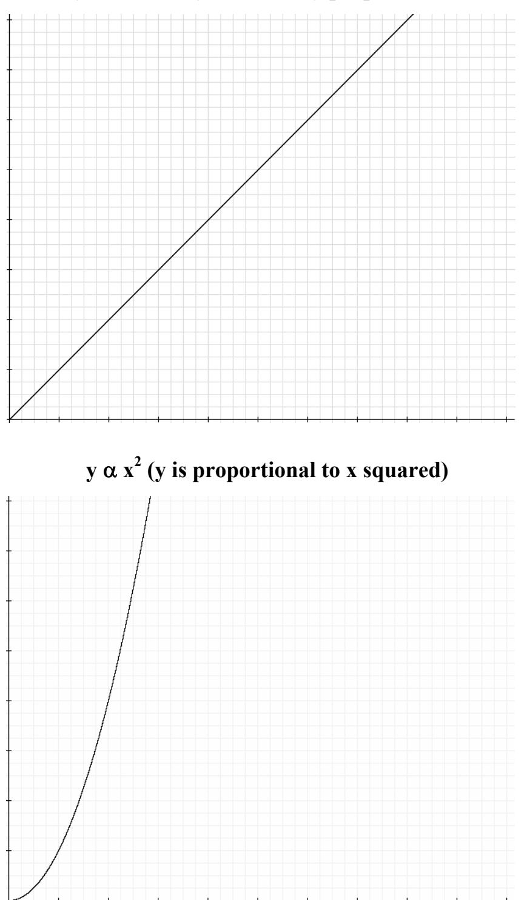
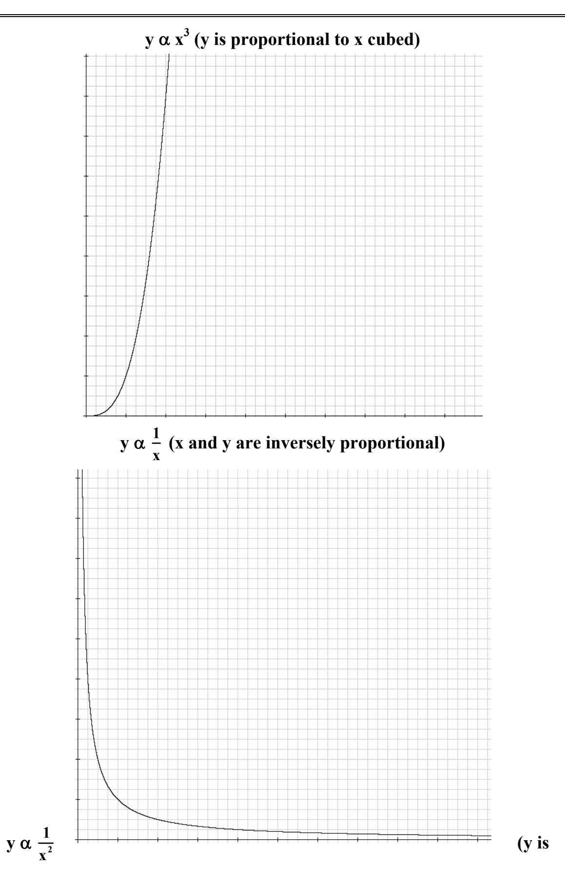
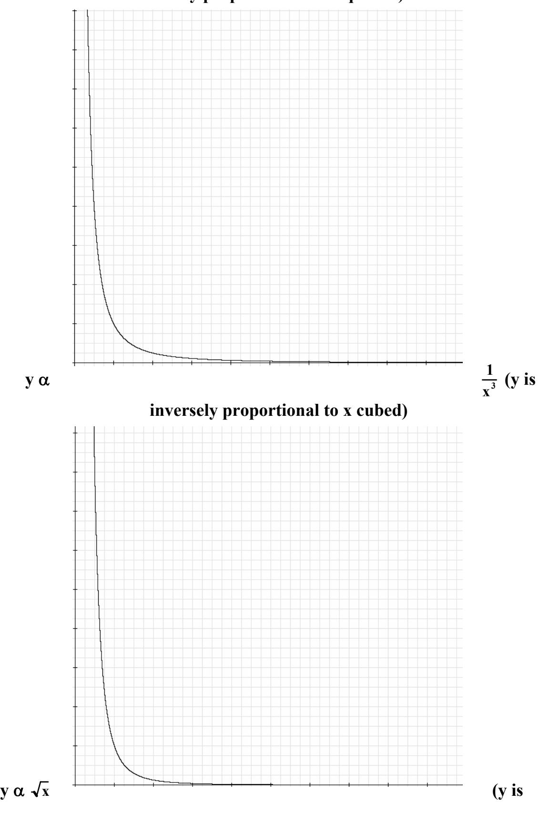
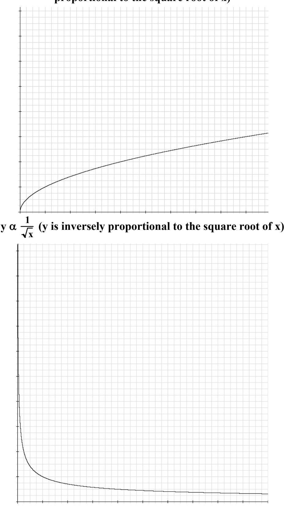

(appI)=
# Appendix I – Graphed Proportions

You will find that numerous exercises in this lab manual will require you to determine the relationship between two variables. This section includes graphs of common proportions that you may encounter in these exercises.

$y\propto x$ ($x$ and $y$ are directly proportional) 

APPENDIX III - 2

**inversely proportional to x squared)** 

**proportional to the square root of x)**