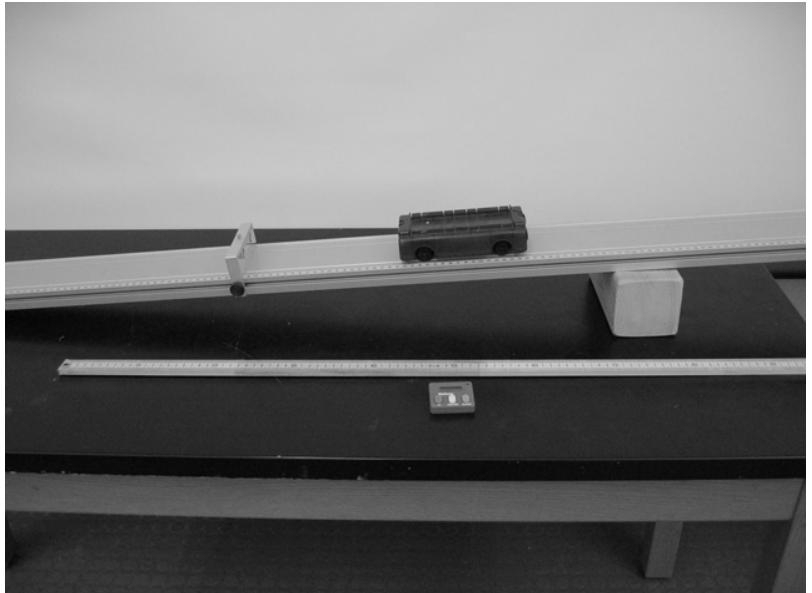

(lab1)=
# Lab 1 - Velocity and Acceleration

Our first task in the course is to establish an understanding of how engineers and scientists define and calculate energy in moving objects. When we have done that, the discussion of energy utilization in society and the consequences for the environment can be discussed. The moving objects which we study at first are objects which you can easily see, like cars and baseballs. It turns out that the same concepts are used in much the same way in the study of very small objects like atoms and molecules which you cannot see without very sophisticated equipment. We will need the applications of the concepts of energy to atoms and molecules to understand energy technologies and environmental problems, but we will not discuss those applications for a few weeks, starting instead with the more easily visualized large moving objects

In physics, all motion is ultimately described in terms of the positions of things at successive times. Position can be specified by giving lengths, as when one says that the physics building is about 20 feet straight north of the math building. Notice that to specify that position (even approximately) I had to give a direction as well as a length. By saying ʹstraight northʹ I told you that you donʹt have to go east or west to get there from math, so I also told you the east west position of the building (again approximately.) For buildings, two lengths, say in the north direction and the west direction, are usually enough, but for an airplane position you would also have to give another length, the altitude. Generally, in our world, three lengths are enough to tell anyone where something is. That is what we mean by saying that space has three dimensions. Time requires less discussion: it is what you measure with a clock.

Now a complete description of the motion of an object can be given by stating its position at each moment in time (a kind of history of the positions which the object takes). However it turns out that in order to define and measure the energy of an object and to predict its motion using physics equations, it is useful to use two other quantities which are closely related to this history of the motion and can be obtained from it. These closely related quantities are velocity and acceleration. We discuss them in terms of the motion of a car. You will do experiments on a toy car in this laboratory in order to measure them. A change in the position of a car, a baseball or any object means there is a change in its *velocity*. A change in velocity means there is *acceleration*. Notice that acceleration is not the same as velocity because there can be a velocity which is not zero, and as long as the velocity is not changing, the acceleration is zero.

Here we briefly repeat the definitions and discussion of velocity and acceleration which are given in the assigned reading for this laboratory (see below). For simplicity we consider only motion along a straight line here, so that position can be specified by just one length. If an object travels along a straight line, as on the track on which the car in the experiments moves, then if it travels a certain time, then its average speed during that time is the distance gone divided by the time elapsed.

If you are driving across Nevada on a very straight freeway, and you go 210 miles in 3 hours then your average speed was 70 miles per hour (210/3). However, your speedometer did not read 70mph the whole time. Sometimes it was higher and sometimes lower. The speedometer measures instantaneous speed which is the average speed averaged over an extremely, immeasurably small, time interval. When you sped up, so that the reading on the speedometer went from 65 mph to 75 mph in 30 seconds then the car had a positive acceleration. To calculate the average acceleration you divide the change in the speed by the time it took. In that case

$${\rm acceleration = (75mph‐65mph)/(1/120 hour) = 1200 miles per hour per hour.}$$

Here I expressed 30 seconds as 1/120 of an hour. What the average acceleration means is that, if you kept on accelerating like that for one hour your speed would in crease by 1200 mph. (Not possible but fun to think about.) If you slow down, and make a similar calculation of the acceleration, you get a negative number. Negative accelerations correspond to slowing down and are sometimes called decelerations. Just as with velocity, you can also measure an instantaneous acceleration (though the measurement is a little trickier) that corresponds to the average acceleration over an extremely small time interval.

## Pre‐Lab Reading

Textbook Chapter 5.1 on Motion

## Equipment

* 1 toy car
* 1 aluminum track
* 1 wooden block
* 1 meter stick
* 1 low friction cart
* 1 stopwatch
* 1 length of string
* 1 video camera
* 1 computer /Motion sensor with Pasco Capstone

## Predictions/Preliminary Questions

1. What does it mean if an object moves with a *constant velocity*? Sketch a graph of velocity vs. time for a car (a motorized toy car in lab) moving with a constant velocity. Put velocity on the vertical axis, and time on the horizontal axis of your graph.
2. In your own words, describe what is meant by *constant acceleration*.
3. Sketch a graph of velocity vs. time for a car that is speeding up with a constant acceleration.
4. Sketch a graph of velocity vs. time for a car that is slowing down.
5. The following graph shows the velocity of a car in meters per second (m/s) measured at several different times. Calculate the acceleration of this car by using the slope of the graph.

```{figure} ../figures/lab1/vvst.svg
:label: fig:lab1:vvst
:width: 100%
:align: center
:alt: Under constant acceleration, an object will have a speed that changes proportionally to time.
Under constant acceleration, an object will have a speed that changes proportionally to time.
```

6. What happens to the acceleration of a cart as it moves down an inclined track? (Does the acceleration increase, decrease, or remain the same?) Explain your reasoning.

There are two parts to this exercise. The first involves a level track, and the second involves an inclined track.

## Part i: Level track

### Exploration

**Before** you start to acquire computer data you need to explore a bit, to try out the other equipment. This is something you will need to do in each lab; most equipment has a range of operation that is simple and straightforward, but outside that range complicated corrections are needed.

1. Place one of the metal tracks on your lab table and place the motorized toy car on the track. Turn on the car and observe its motion. The battery powered toy car should move at constant velocity on the aluminum track. Do you think it does? Why or why not? You may also want to see if you can get a PASCO cart to travel at constant velocity for taking data.
2. It is often useful to make approximate measurements without using complicated equipment. For example, use your forearm as a unit of distance and count seconds by counting one‐ thousand‐one, one‐thousand‐two, etc. Then you might measure, with your arm, (don't use a meter stick) three arm lengths along the aluminum track. Let the car run that three arm length distance and measure the time by counting – one‐thousand‐one, etc. To determine the speed, divide three arm lengths by the time in seconds and obtain the speed in terms of arm‐lengths per second. Each person in the group should try this approach at least once.
3. Take some measurements with the meter stick and a stopwatch to calculate the approximate speed of the battery powered car. Explain how you determined its speed (or velocity). Be sure to record the units you are using for each value.
4. How would a graph of horizontal distance vs. time look for the car going at a constant velocity? Sketch this graph in your lab notebook. (You don't need numbers on this graph – just a sketch to show the shape of the motion.) Put distance on the vertical axis and time on the horizontal axis of your graph.
5. Sketch a graph for velocity vs. time for the car going at constant velocity (no numbers are needed ‐ just a sketch.) Put velocity on the vertical axis and time on the horizontal axis.

You should have agreement among your lab partners about the approximate velocity of the car. You should also compare graphs. If you don't agree, continue with the lab knowing that there should be a consensus on the graphs before the end of the lab session.

### Procedure

**Exploration with Capstone software** *For instructions about using the Capstone data collection software or Motion sensor, refer to the appendices at the end of this lab manual.*

On the computer desktop open the Capstone software with the motion detector connected. In the upper left corner, a small icon should show that the interface is connected and that a motion sensor is plugged in. If you have problems, check your connections and inform your TA.

To collect data you press the Record button. Practice collecting data of the toy car. Make certain everyone in your group has a chance to operate the computer. You can adjust the settings in Capstone to graph position vs. time, velocity vs. time and/or acceleration vs. time. Please read the appendix on using Capstone and take time during lab to make sure you can create all graphs necessary.

If possible, every member of your group should operate the computer.

### Analysis

1. From the graph of distance vs. time, calculate the slope of the line. How is this slope related to the velocity of the car? Capstone allows you to fit curves automatically, read your appendix to find out how.
2. From the velocity vs. time graph, what can you tell about the acceleration of the car? Explain how you can tell this from the graph.

## Part ii: Inclined track

Use a low friction PASCO cart – not the battery toy car. Put a wood block under the aluminum track to make the incline. (One block is probably all you need.) **Be certain to catch the cart before it falls on the floor!**



Discuss with your partners and make a prediction: How would you expect a velocity vs. time graph to look for a cart rolling down an incline? Draw a sketch of the graph. Explain what coordinate system you are using

### Exploration

1. Use a meter stick and a stopwatch to determine the average velocity of the cart rolling down the incline.
2. Use a meter stick and a stopwatch to record the distance and time for several points along the inclined track when the cart is rolling down the incline. You might need to release the cart more than once.
3. Make a graph of distance vs. time for this measured data.

### Procedure

Use the computer to obtain graphs of distance vs. time and velocity vs. time for the cart on the incline. Refer to the proper appendix if you need assistance using the software, interface or sensor.

### Analysis

1. How can you obtain the acceleration for the cart from the velocity vs. time graph?
2. What is the acceleration of the cart moving down the incline?
3. Is the acceleration of the cart increasing, decreasing, or constant as it rolls down the incline? How can you tell?
4. How does the value of the acceleration for the cart compare to an object in free fall (9.8 meters per second every second)?

### Conclusions

1. Did either the battery car or the cart have a constant velocity? If so, which one(s)?
2. Did either object have a constant acceleration? If so, which one(s)?
3. Sketch a graph (without numbers) of distance vs. time for an object moving with a constant velocity.
4. Sketch a graph (without numbers) of distance vs. time for an object moving with an increasing velocity.
5. Sketch a graph (without numbers) of velocity vs. time for no acceleration.
6. Sketch a graph (without numbers) of velocity vs. time for constant acceleration.
7. How do your measured graphs compare to your predictions? Can you, in the future, identify motion with a constant velocity and motion with a constant acceleration?
8. Galileo concluded: "A body is said to be uniformly accelerated when, starting from rest, it acquires equal increments of velocity during equal time intervals." Does his definition of constant acceleration agree with your observations?

## Historical notes

Galileo held *ignorato motu ignorator natura,* or ʹignorance of motion is ignorance of natureʹ - now you and your partners have a start in understanding velocity and acceleration, which will lead to ideas concerning energy and its role in the natural world.

In this exercise you and your partners analyzed the motion of a motorized car on a horizontal surface (aluminum track) and the motion of a cart on that same surface when tilted. The track and wheels

minimized friction. The equipment is not so different than the tilted board used by Galileo in 1608 to study acceleration:

A piece of wooden moulding or scantling, about 12 cubits [about 7 m] long, half a cubit [about 30 cm] wide and three finger‐breadths [about 5 cm] thick, was taken; on its edge was cut a channel a little more than one finger in breadth; having made this groove very straight, smooth, and polished, and having lined it with parchment, also as smooth and polished as possible, we rolled along it a hard, smooth, and very round bronze ball (*Discourses on Two New Sciences,* 1638).

Galileo hoped to investigate the motion of falling objects; however, most objects fell too quickly to measure their velocities with the equipment available to him. His solution was to use an inclined plane. He utilized a tilted board with a groove, down which he rolled a metal ball, to test Aristotelian ideas about motion. Galileo's experiments with his inclined plane were revolutionary because he focused on acceleration, a form of motion overlooked by Aristotle and his followers.