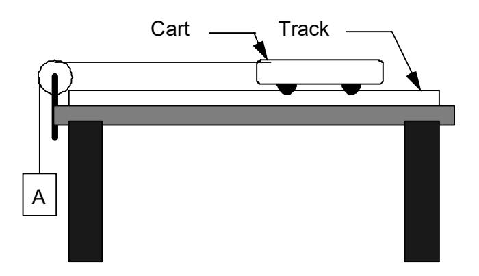
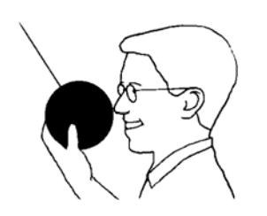

(lab3)=
# Lab 3 - Conservation of energy

This week we have enough of the basic concepts to begin a discussion of energy itself. Energy is sometimes introduced as if it is a concept independent of Newtonʹs laws (though related to them). In fact, however, the idea of energy arises directly out of Newtonʹs second law, and Newtonʹs second law actually guarantees a central fact about energy, namely that no energy is ever lost or destroyed, but simply changes form, the so‐called law of conservation of energy.

This can be illustrated by the example of the falling ball (You can think of one which Galileo dropped.) The example involves just a little bit of algebra which we use to show how the energy conservation law comes out of Newtonʹs second law. Remember that the gravitational force on the falling ball is the constant mg, where m is the mass of the ball and g is a constant acceleration due to gravity. Therefore Newtonʹs second law takes the form

#### $mg=ma$

for the falling ball. Now the acceleration is the speed divided by the time elapsed.

In Newtonʹs second law, it should be the instantaneous acceleration, but because the acceleration is a constant for the gravitational force the instantaneous acceleration is the same as the average acceleration. Consider the moment just before the ball hits the ground, supposed to be a time t since it was dropped. If the speed is v then, the

acceleration is v/t. Putting this in the previous equation

#### $mg=mv/t$

Now suppose the ball fell a distance d. To turn the preceding equation into an equation involving energy we multiply both sides of the previous equation by d

#### $mgh=(mv/t)h$

Now d is the average velocity times t. Here the ball was accelerating so the average velocity is not the final velocity just before it hits the ground but is ½ of that velocity so d=(v/2)t. I substitute this for d in the righthand side of the previous equation and simplify

## $mgh=(mv/t)(v/2)t=(1/2)mv^2$

This is an equation which describes how energy is conserved for a falling ball. On the left hand side, the quantity mgd is the force on the ball times its height d above the ground before it was dropped. We call it the gravitational potential energy of the ball before it was dropped. On the right hand side is a quantity (1/2)mv2 which is called the kinetic energy of the ball just before it hits the ground. We interpret the = sign to mean that the gravitational potential energy of the ball before it fell was converted into an exactly equal amount of kinetic energy which it had just before it hit the ground.

To summarize, for a falling ball, two forms of energy, kinetic and gravitational potential, are involved. The sum,

# total energy = gravitational potential energy + kinetic energy

stays the same during the motion, but at the beginning of the fall it is all gravitational potential and at the end it is all kinetic. In between, though we did not prove it, the gravitational potential energy gradually decreases while the kinetic energy increases to keep the sum constant. The fact that the sum is unchanged is what we mean by conservation of energy in this case. I showed by algebraic manipulation of Newtonʹs second law that this follows from Newtonʹs second law and is not an independent principle. This conservation law turns out to apply for any system of objects obeying Newtonʹs equation, though some other forms of potential energy need to be introduced. Though it follows from Newtonʹs equation,

the conservation of energy is often easier to apply and think about than the general solution to Newtonʹs equations, so we will often apply conservation of energy considerations to study of complicated situations without worrying much about the underlying Newtonian mechanics.

In this exercise, you and your partners will investigate the law of conservation of energy with an aluminum track and a low‐friction cart attached to a hanging mass. You will calculate: (i) the total change in kinetic energy of the cart and hanging mass, (ii) the change in the potential energy of the hanging mass. According to the conservation of energy and the relationship between work and energy, these quantities should be equal.

**Figure 1:**

**Pre-Lab Reading** 

Hinrichs and Kleinbach, pp 48‐50

# Equipment

- 1 aluminum track
- 1 pulley
- 1 mass hanger
- 1 meter stick
- 1 video camera
- 1 low‐friction PASCO cart
- 1 piece of string
- 1 mass set
- 1 stopwatch
- 1 computer /LapPro interface and Motion sensor w/Capstone

# Predictions/preliminary questions

A cart is located on a level air track with a string attached between the cart and a weight. The weight is hanging by the string so it can pull the cart along the track. (See the diagram in figure 1.)

1. When the weight is hanging below the pulley but above the floor, what form of energy could be used to describe the energy of the weight relative to the floor? What quantities would you need to know or measure to calculate this energy?

- 2. Does the potential energy of the **hanging weight** increase, decrease, or stay the same as it falls to the floor?
- 3. Does the potential energy of the **cart on the track** increase, decrease, or stay the same as it is pulled by the hanging weight?
- 4. Suppose the weight falls from a certain height and pulls the cart along the horizontal track. Just before the weight hits the floor, what form of energy does it possess?
- 5. Using the law of conservation of energy, describe the energy situation just before the hanging weight starts falling compared with the energy situation just before the weight hits the floor.
- 6. Write an expression for the work done by gravity in pulling the weight from its initial height to the floor. What quantities do you need to measure to calculate the work done on the hanging mass?

#### Procedure

In this exercise, you and your partners will calculate :**i)** the total change in kinetic energy of the cart and hanging mass and **ii)** the change in potential energy of the hanging mass.

**1.** The change in kinetic energy of the cart and hanging mass can be calculated. The two objects will both start at rest, so their initial kinetic energies are zero. The cart and the hanging mass will accelerate at the same rate (a string connects them.) The velocity of one object will always be equal to the velocity of the other, as long as the string remains taut.

With the computer data analysis software, you can find the velocity of the cart or hanging mass at any point in time. You and your partners are interested only in the final velocity. (After the weight hits the floor, what happens to the speed of the cart?) The mass of the cart and that of the hanging mass can be determined with a triple‐beam balance. Refer to the appendix on using Capstone if necessary. With this information, calculate the kinetic energy of each object separately. Recall that kinetic energy is:

$$
K\!\!E = \frac{1}{2}mv^2
$$

where *m* is mass of an object and *v* is the velocity. Be sure to use the proper SI units: kilograms for mass and meters per second for velocity. To calculate the total change in kinetic energy, you must add the final kinetic energy for both the hanging mass and the cart.

**2.** There is no change in the gravitational potential energy of the cart – if the track is level, its height off the floor does not change. Only the height of the hanging mass changes. As a result, only the potential energy of the hanging mass changes. Define the floor as the point of zero potential energy. Recall the equation for gravitational potential energy:

$$
PE = ngh
$$

where *m* is the mass of the object, *g* is the acceleration of gravity on Earthʹs surface, and *h* is the height from the point of zero potential energy. Use this equation and the measured mass of the hanging mass and the distance if fell to calculate the potential energy,

## Conclusions

- 1. Comment on your values for the total change in kinetic energy of the cart and the hanging mass and the change in potential energy of the hanging mass.
- 2. a) Do your values support the conservation of energy? Explain. b) How can you account for any discrepancies between these values?

Consider the following situation: A physics instructor demonstrates the conservation of energy with a bowling ball attached to the ceiling with a string. It is simply a large pendulum. When the pendulum is pulled back, it has all potential energy, and at the bottom of its swing, it has all kinetic energy. The physics instructor releases the bowling ball from the tip of his nose, and it swings across the room and back toward him. Based on the conservation of energy and your results for this exercise, will this physics

instructor get smacked by the bowling ball? Will it touch his nose? Explain. What if he gave the bowling ball a slight push when he let go? Explain your answers. If there is a difference, distinguish between what happens in theory and what happens in the real world.
