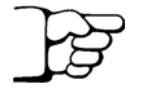
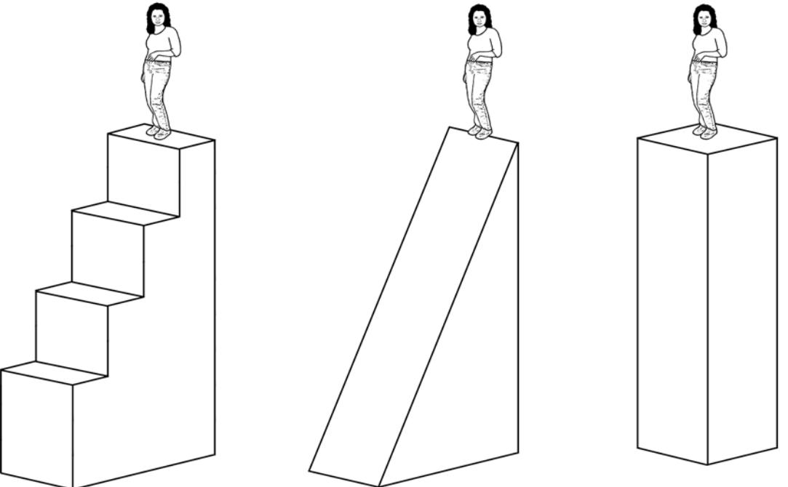
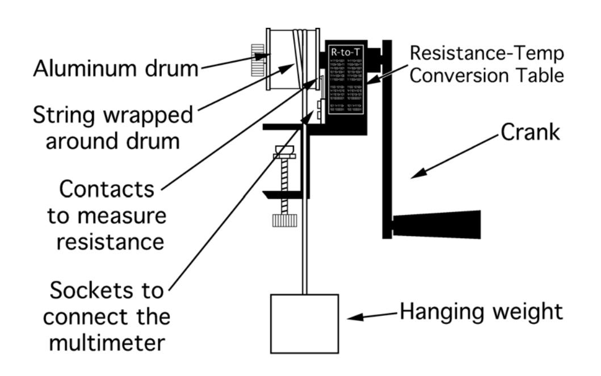
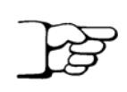

(lab4)=
# Lab 4 energy transfer through work

In previous laboratories you have studied the energy of a body or collection of bodies which could be regarded for the purposes of the experiment as isolated. We did not have to consider the transfer of energy from one body to another explicitly. However in energy technology such as the delivery of electricity to your home where it is converted to other forms for your use or the delivery of the chemical energy in gasoline to your car where it is converted through two steps to the kinetic energy of your car, energy transfer from one body to another is of utmost importance. Energy transfer from one body to another takes place through the action of work. To illustrate this, we will turn back to the falling ball discussed in laboratory 2, but this time, suppose that, before the ball was dropped, you picked it up off the floor and lifted it up to height d for dropping. For simplicity we will suppose that it was lifted slowly and steadily so that we can ignore any accelerations and decelerations during the lift. From an energetic point of view, what is happening to the ball is that gravitational potential energy is being added to it. Where did that energy come from? It came from your body, where the energy was stored in the form of chemical energy in your muscles. We want to focus on the mechanism by which the transfer took place: As you lift the ball, a gravitational force mg (massxgravity) acts down on it and you exert a slightly larger force upward on it with your hand. Since we are ignoring accelerations and decelerations as small we can suppose that this upward force is also of magnitude mg (though it has a completely different origin than the downward force). Now the net energy added to the ball is the gravitational potential energy mgd. Therefore

Energy transferred to the ball during lift =mgd

= (magnitude of the upward force due to your hand X distance through which the force acted)

We say that your hand performed work on the ball equal to the force you exerted on the ball times the distance through which it acted. The conclusion from this example can be generalized: When a body exerts a force on another body and the body moves through a distance, energy is transferred to the other body. The magnitude of the energy transferred is the product of the magnitude of the force times the distance, along the direction of the force, through which the force acts.

When energy transfers of this sort occur it is often relevant to the engineering application to know how fast they occur. Therefore we introduce the concept of power, which is the rate at which energy is transferred due to the performance of work and is given by the amount of work done divided by the time elapsed.

In this laboratory, you will perform two experiments in which work is done and energy is transferred to a body. The first case is a little tricky because it appears that the body, actually your body, is doing work on itself: You will be running up stairs and measuring the rate at which you add gravitational potential energy to your body. However, one can regard this as a transfer of chemical energy stored in your muscles to the gravitational energy of your body as a whole through the performance of work which is done as you push your self upstairs with your legs. (If you think about it you will find it a little tricky to analyze how you push yourself upstairs, but it is clear that a net upward force must result.)

In the second experiment you will turn a crank which causes a wheel to rub against an aluminum cylinder. In this case chemical energy is converted ultimately to the thermal energy in the aluminum, manifested as a rise in its temperature. As we will discuss, thermal energy is actually a form of kinetic and potential energy associated with the random motion of the molecules of a substance (aluminum here).

# Part 1. transfer of chemical energy to gravitational potential energy through work

As you run up stairs, you use over two hundred muscles. When you walk or run, your muscles use energy both to propel your body forward and to move it against gravity. The energy to do this comes from your food. Your muscles convert the chemical energy of adenosine triphosphate (ATP) into mechanical work. In this exercise, you and your lab partners will find your own work and power output when running up a single flight of stairs and then four flights of stairs.

# Pre‐lab reading

Hinrichs and Kleinback, pp 47‐57

# Equipment

- 1 stopwatch
- 1 meter stick
- 1 bathroom scale

# Predictions/preliminary questions

(Look at the lab procedure and pre‐lab reading for help in answering these questions. For converting energies into different units, you can use Appendix B of your book (page B.I) or Table 3.4 (p.91))

- 1. Estimate the work you would do in climbing a set of stairs with a vertical height of 4 meters. (Use the weight of a person in kg) If you know the weight of a person how do you find the force of gravity on the person?
- 2. What is the relationship between the work you do in climbing a set of stairs and the potential energy you gain in going up the stairs?
- 3. Estimate the time it would take to walk up the set of stairs and use that to determine the power you would develop in climbing those stairs.
- 4. Estimate the amount of horsepower you develop in climbing those stairs. Note: 746 watts of power are equivalent to one horsepower.
- 5. If you run up the stairs (instead of walking) will you be developing more horsepower or less? Explain your reasoning.
- **6.** If you walk up several flights of stairs do you think the power you expend would be greater, the same or less than when you walk up only one flight? Explain your reasoning.

# Procedure

In this exercise, you and your partners will calculate your work and maximum power output when climbing stairs. Remember that work is a change in energy. When you climb a flight of stairs, you have increased your potential energy (you now have the potential to fall down the stairs under the influence of gravity). How fast this change in energy occurs will allow you and your partners to determine the power output involved.

*This exercise requires physical activity. If you are unable to participate due to an injury or asthma, tell your instructor. Be careful on the stairs so you donʹt trip or collide with anyone else. Someone acting as a ʺlookoutʺ is a good idea.* 

- 1. To calculate your potential energy, you must know your mass. Measure your weight in pounds on the scale and multiply by 0.45 to find your mass in kilograms.
- 2. You must also know your change in height to calculate your potential energy. Use the meter stick to determine the height of one flight of stairs and four flights of stairs. Be careful ‐‐ the physics building is a little strange. The flights of stairs have different numbers of steps, and some of the flights even have steps with a different height!

*In each case, the student has the same gravitational potential energy, and she has done the same amount of work to reach the top because (neglecting friction) she does no work when she moves horizontally. Work is required, though, for her to move against earth's gravity.*

- 3. Each member of your lab group should run up one flight of stairs (from one landing to the next) while someone records the time taken. Next, each group member should run up four flights of stairs (two stories) while someone records the time taken.
- 4. Calculate the work you did in lifting your body against the gravitational force. The work done is equal to your change in potential energy. To find your power, divide the change in potential energy by the time it took to climb the stairs. Report the results.

# Conclusions

- 1. Report your leg power in watts (Joules per second). Divide your result by 746 in order to find your power in horsepower. How does your work and power compare to that of your partners? Did anyone do more work than you but used less power? Vice versa? Who did the most work? Who had the greatest power output? The least?
- 2. As you climb the stairs, you convert food energy into kinetic energy. A major part of this conversion, however, is heat that is lost to the air. In fact, about 75 percent of the energy from food becomes heat. Only 25 percent of the food energy is converted to work. Based on your leg power and the efficiency of converting food energy into work, how long would it

take you, climbing stairs, to burn off a Big Mac (570 kilocalories)? How about a Double Whopper with cheese (1010 kilocalories)? One calorie (not Calorie) equals 4.2 Joules.

3. How does your power for a single flight compare to that for four flights of stairs? Read the following article about the Annual Empire State Building Run‐Up. Consider the record‐ holders and the 88‐year‐old orchestra conductor. Assume that the men ‐‐ Paul and Chico ‐‐ weigh 170 pounds and that Belinda weighs 130 pounds. Calculate their work and power. Compare to your work and power, and explain the differences. Also consider long distance runners and sprinters. A typical long distance runner has a maximum power of 9 watts/kg body weight, and a typical sprinter has a maximum power of 15 watts/kg body weight.

#### 22nd Annual Empire State Building Run‐Up February 23, 2000

This ainʹt no party, this ainʹt no fooling around. This is the 23rd annual Empire State Building Run‐Up, ʺthe worldʹs most elevating workout.ʺ Organized by the New York Road Runners Club (NYRRC), the race offers 30 minutes of uphill torture.

Starting at 10:30am, beginning in the lobby of the Empire State Building on 34th Street about 150 runners attack flights of stairs in one of the world's most famous landmarks. According to our abacus, that comes to 1576 steps, for an ascent of 1050 feet – approximately 1/5 of a mile. The stairs themselves are only 40 inches wide – plenty of room for cockroaches, but not much for humans. And the view? There is none, until you reach the top. A ceremony immediately follows on the 86th floor, where the male and female winners each get a trophy.

Why run up all those stairs in the first place? Running from New Yorkʹs finest muggers and assailants? Hardly. The real reason lies with Fred Lebow, founder of the NYRRC. Twenty years ago Fred lived in a walk‐up – a type of apartment building without an elevator – and he figured that if he walked up stairs every day, why not run a race up them? While the idea might seem simple, it has caught on in a big way. Not only is this the NYRRCʹs 23rd run, but the concept itself has been appropriated by copycats in Chicago, in Toronto, in Moscow, and in Sydney.

If you find yourself inspired to rush over to scale those steps with the other runners, donʹt bother. You see, this is a special race in a special town. You must apply in writing to the NYRRC for approval and explain in an emotional essay how youʹve been deprived since birth and why you deserve this type of punishment. If approved, youʹll be notified. Donʹt call them, they will call you. Oh yeah, and you will also sign every medical release known to man.

So who made the cut? Last year, 150 runners from 9 countries and 12 US states crammed their way up those stairs. Ages ranged from 20 to 87, including an optometrist, a nanny, and an air traffic controller. Watch out for the Australians; they hold the record time for the men (Paul Crake made a new record last year, at 10:15 – thatʹs 155.3 steps per minute!) and the women (Belinda Soszyn, 12:19, set in 1996). And look for Chico Scimone, the 88‐year‐old orchestra conductor from Italy, who has run the race several times, logging last year at 34:21. Heʹll be running with some family members this year; and, reportedly, heʹs in even better health than last year! Not bad for 88. Certainly a lot faster than most of you.

WhatʹsGoingOn.com; Copyright © 1996‐2001 Nother Company LLC

# Note on Energy Use by the Human Body

ATP is the primary energy source of cells. As its name would suggest, this compound has three phosphate groups, and energy is stored in these chemical bonds in the same way that electrical energy is stored in a battery. With this energy, your muscles produce a force by contracting. When attached to bones by a series of tendons, a contracting muscle can pull two bones together, using the bones as a lever. If you exercise more than a minute or so, then the energy in the ATP in your muscles gets converted to its lower energy form and has to be restored. The slow step in doing the restoration is getting enough oxygen into your blood which is why you start to breath hard if you run for a while. If you are running hard, use up the ATP and your lungs arenʹt pumping oxygen in fast enough, then your body will switch over to another source, a kind of energy in sugar called glycogen in your blood. The use of glycogen results in an excess of lactic acid in the blood, which can cause cramps and discomfort. The glycogen supply only lasts a few minutes if itʹs being used at the maximum rate. Itʹs used by athletes in sprints and dashes and the lactic acid results in incapacitation for as much as an hour after such events while the glycogen is restored and the lactic acid is cleared from the blood. If you run at a pace which can be sustained for a long time, because the oxygen is supplied fast enough to keep up with its use, then the glycogen is only involved in a minor way and you can run for hours (as in marathons). For most humans the power production under those conditions is around 1/4 horse power.

#### Part 2: transfer of mechanical to thermal energy through work

Thermal energy is central to the operation of many of the energy technologies which we discuss in this course. In most electrical power generation, coal is burned to convert chemical energy to thermal energy which is then converted to mechanical energy in turbines and finally to electrical energy through processes we will discuss later. Most transportation involves conversion of chemical energy to thermal energy which is in turn converted to kinetic energy of the vehicle. So what is thermal energy? Basically, though it took more than a century to establish this, thermal energy is understood to be a form of kinetic and potential energy arising from the random motion of the atoms and molecules in the material, gas or liquid which is heated. Temperature, as measured by a thermometer, is directly related to the amount of kinetic energy in the molecules and atoms. However, because there is also potential energy associated with the forces between the atoms, the temperature alone does not give enough information to calculate the amount of energy added to a material when its temperature rises by a fixed number of degrees. To take account of the added potential energy one needs to know the specific heat c of the material whose temperature is changing. One calculates the added thermal energy through the formula

Added thermal energy = (specific heat c) x (change in temperature)x(mass of material)

In this experiment, you will turn a crank which causes a cable to rub against an aluminum cylinder. The rubbing causes an increase in the random motion of the aluminum atoms in the metal drum, a rise in its temperature and an increase in its thermal energy. You can calculate the work done by multiplying the magnitude of the force by the distance through which it acts and you can calculate the added thermal energy by use of the above equation, knowing the specific heat of aluminum

(which is given below) if you measure the temperature rise and the mass of the aluminum. By comparing these two numbers, you can confirm the conservation of energy in this process.

Historically this kind of experiment, which was done very early by some of the people who discovered that thermal energy was a form of mechanical energy, was regarded in a somewhat different way, as establishing the relationship between the units of heat (calories) and the units of mechanical energy (joules). It was eventually found that one calorie equals 4.186 joules.

#### Pre‐lab reading

Hinrichs and Kleinback pp97‐105

## Equipment

- 1 Mechanical Equivalent of Heat apparatus
- 1 weight on a rayon string
- 1 digital multimeter
- 2 wires with banana plugs

#### Predictions/preliminary questions

You and your partners will do work on the aluminum cylinder by turning a crank. A rayon string will be wrapped around the cylinder several times. When you turn the crank, friction between the cylinder and the string will hold up the weight and will heat the drum. Since you are applying force over a distance, you can calculate the work done on the cylinder. You can also measure the cylinderʹs temperature and will know the specific heat of aluminum, so you can calculate the heat energy produced. The work done depends on the number of times you turn the crank. You will calculate the number of turns needed, in theory, for a specific increase in temperature. You and your partners will compare this theoretical number to your experimental result and consider any differences.

**1.** Before you do your first trial, you must find the theoretical number of turns of the cylinder needed to raise its temperature by a particular amount. With your lab partners, choose a temperature change of at least 8 degrees Celsius. This will be the temperature increase of the drum that you will use in the so‐called heat equation:

Added thermal energy = (specific heat c) x (change in temperature)x(mass of material)

- . The value for the specific heat of aluminum in SI units is 900 joules/kg degrees C.
- **2.** According to the conservation of energy, the amount of heat transferred *Q* must equal mechanical energy input, or the work you will do on the drum. After you calculate the heat energy, you and your lab partners must consider the work you will do on the drum. Remember that work is a force applied over a distance. The force will equal the pull of gravity on the hanging weight. The distance will equal the drumʹs circumference times the number of times you turn the drum with the crank. In the form of an equation, the work done on the aluminum drum will be:

$$
Work_{gravitational} = (m_{weight}g)(\pi D_{cylinder})(N)
$$

Where *m* is the mass of the hanging weight, *D* is the cylinder diameter, and *N* is the number of times you turn the crank. With this equation, find the number of turns necessary to increase the heat energy of the drum by the amount you calculated in the first step.

#### Procedure

With your theoretical number of turns, you are now ready to conduct your trial. Secure the drum apparatus to the table with the clamp. Place your weight on the floor beneath the drum. Wrap the string around the drum two or three times, enough that you hardly need to pull on the string when turning the drum to keep the weight at a constant height off the floor. Practice turning the drum while pulling gently on the string to raise the weight a few centimeters off the floor. As the drum turns and the string slides over it, the friction will heat the drum.

*It is a very good idea not to place your feet under the weight. It has a mass of over 8 kilograms and is sufficiently heavy to break your toes if it accidentally falls from a height of several centimeters. Also, never let go of the crank when the weight is off the floor or it will spin rapidly and bruise fingers.*

- **1.** You will measure the aluminum cylinderʹs temperature with a temperature‐dependent resistor cleverly called a thermistor. As the temperature of the aluminum increases, the resistance of the thermistor will decrease. The multimeter will be used to measure the resistance of the thermistor. So, set the multimeter to measure resistance (the symbol for which is Ω), and attach it to the apparatus with the wires provided. Record the resistance, and use the conversion table on the apparatus to find the initial temperature. If this resistance is not close to one of the temperatures on the table, grasp the drum with your hand to increase its temperature to a more convenient one. To the initial temperature, add the temperature change on which your group decided in the first step. This will be your final temperature. Use the conversion table to ascertain the resistance of the thermistor when it reaches this final temperature.
- **2.** Choose someone to turn the crank (if the counter is not working, this person must also count the number of turns), someone to hold the end of the string, and someone to monitor the resistance. The person who is monitoring the resistance should watch for the thermistorʹs resistance to decrease to that which corresponds to the desired final temperature (use the conversion table printed on the apparatus to decide these values beforehand.)
- **3.** Start turning the handle at a rapid pace. Be certain that the apparatus is properly attached to the table so nothing will fall. The hanging weight should stay a constant height off the floor as you

turn the handle ‐‐ this way the gravitational potential energy of the hanging weight does not change. It is easy for the cord to start wrapping around the cylinder, and it might take some practice to keep this from happening.

**4.** When the resistance reaches that of your final temperature, stop turning the crank, and record the number of turns. Then compare the number of actual number of drum turns to the number predicted in the second step. Your instructor may ask you to do a second trial with a different change in temperature.

#### Conclusions

- 1. What was the amount of thermal energy transferred to the aluminum cylinder for each trial?
- 2. Compare the number of actual turns needed to add this amount of thermal energy to the cylinder to the number predicted by your calculations in the second step.
  - a) Did you have to turn the crank more times or fewer than predicted?
  - b) What are possible explanations for differences between your predicted and measured number of turns?
  - c) Is there any source of error or uncertainties in your measurements?
- 3. Was there any energy lost? How do you know? Are there assumptions in your prediction that account for differences?
- 4. What could you and your lab partners change to increase the accuracy of the theoretical number of turns? What would you expect if you performed your trials outside instead of indoors? Explain your answers.
- 5. Using what you have learned about the flow of heat, discuss how the specific heat capacities of aluminum and copper affect the use of these metals in flat‐plate solar collectors. (Refer to the Historical Notes below. The specific heat of copper is 387 J/kgC)

#### Historical notes

Flat‐plate solar collectors were invented late in the seventeenth century, but it was not until the 1960s that the collectors were developed and used around the world. The most common types in the world are all‐copper solar collectors and copper‐aluminum hybrid collectors. In fact, some indigenous communities in the Amazon use collectors described as ʹʹan aluminum module with the copper soulʹʹ to provide power to their villages. A typical flat‐plate collector is comprised of a rectangular surface, called an absorber, with a series of fluid tubes running along it. It is the absorber that is commonly aluminum, copper, or a composite of both.
