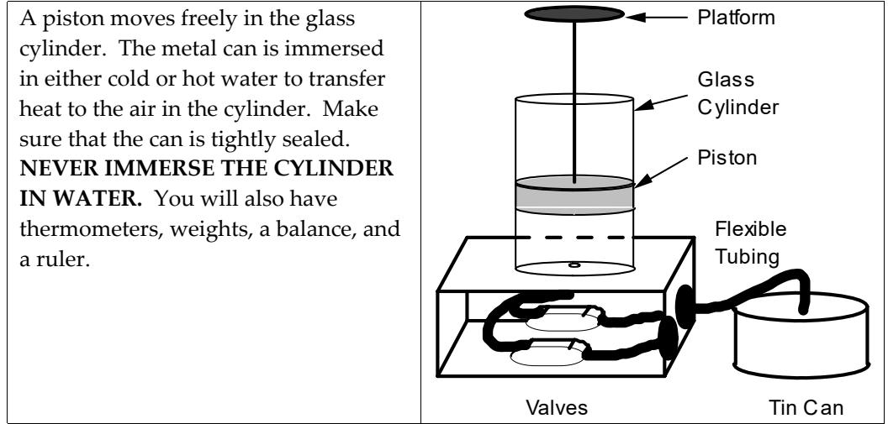

(lab7)=
# Lab 7: Mechanical from Thermal Energy: a simple thermal engine and the 2nd law of thermodynamics

Most of the energy which is delivered for use to consumers in our society takes the form of thermal energy at some point before itʹs used. In automobiles, trucks, buses, airplanes and most railroads, hydrocarbons (storing chemical energy) are burned to produce thermal energy which is then converted back to gravitational potential and kinetic energy of the vehicles. In most electrical power plants (but not nuclear or hydropower ones) hydrocarbons are burned and the resulting thermal energy is converted to mechanical energy in turbines and then to electrical energy which is carried by the power lines to consumers. This week we are considering how the thermal energy is converted to kinetic or gravitational potential energy of large (that is not molecular size) objects in engines. That's the central physical process behind the extraction of energy from fossil fuels discussed in Chapter 7 of your book.

In this laboratory you will do some experiments on an extremely simple form of a heat engine which makes this conversion. Though this process of converting thermal to mechanical energy is the opposite of the conversion of mechanical to thermal energy which you carried out in Laboratory 4, a new and somewhat surprising feature enters: Although the energy is conserved in the process, it turns out that you CANNOT convert all the thermal energy to mechanical energy. There is always some waste thermal energy left over. This general statement is one version of the second law of thermodynamics. It was discovered experimentally in the nineteenth century and versions of the second law have guided the design of thermally driven engines since. Because of the second law, any thermal engine puts out less useful energy than the initial thermal energy that goes in (unless, of course, you want the heat itself, as in a furnace. Then you can get 100% of the energy for that in principle. ) The efficiency of a thermal engine is defined as the ratio of the useful energy coming out to the thermal energy going in, and is always less than 1. Under certain rather general conditions, one can go further and state that if the thermal energy in the input is at absolute temperature $T_H$ and the waste thermal energy leaves the engine at absolute temperature $T_C$ then the maximum possible efficiency is

$$\text{maximum~efficiency~of~a~thermal~ engine}~=~\frac{(T_h ‐ T_c)}{T_h}\label{eq:lab7:efficiency}$$

You will test this statement in the experiments on the simple engine used in the laboratory in this experiment.

The simple engine you will use uses thermal energy to lift objects. A piston that lifts the objects moves up and down inside of a cylinder filled with air. The air inside the cylinder is connected with a tube to a sealed metal can that can be heated and cooled by placing it in hot or cold water. A cycle starts with an object on top of the piston and the can immersed in cold water. The can is then immersed in hot water and the cylinder rises. At its highest point you remove the object and the piston rises some more. Next the can is placed into cold water. The piston descends. When it stops descending, you put an object on it causing it to go lower. The system is now in its original state. Then the cycle is repeated. Even though the process is very simple, all of the heat from the water does not go into lifting the object and you will determine its efficiency.

## Equipment

## Prediction

The hot water cannot be any hotter than boiling (approximately 100 oC = 373 K) and the cold water cannot be any colder than ice water (0 oC = 273 K) . What is the maximum efficiency which you can hope to find for this device?

## Pre‐lab reading

????

## Warm‐up questions

1 Write down the general conservation of energy equation. Decide on the most convenient system for this situation. Decide on your initial time and choose your final time when the system returns to its initial state. Is any energy being transferred to or from your system between the initial and final times? The energy transfers may happen at different times in the cycle so write down a list of what the system is doing for each energy transfer.
2. Identify the terms you need to calculate the efficiency of the process. The efficiency is the ratio of the useful energy output to the energy input from the energy source. Write down the conservation of energy equation or equations containing those terms.

## Exploration

Familiarize yourself with the piston apparatus. Learn how the valves work. Does the piston move easily in the cylinder when the valves are open? When the valves are closed? When one is open and one is closed? All valves are likely to leak at some level. Check if your valves leak enough to seriously affect your measurement. Record how you made this determination.

The piston makes a seal with the cylinder but all such seals leak at some level. Check if your piston leaks enough to seriously affect your measurement. Record how you made this determination. Check to see if this leak depends on how much mass you put on the platform. This will tell you the maximum mass for which your results will be reliable.

How will you determine the height of the piston accurately and consistently? How large a mass will you need to give you a height change that you can measure accurately? This will tell you the minimum mass for which your results will be reliable.

Check that the can does not leak too much to affect the reliability of your measurements. If it does, check the stopper.

Run through the cyclic procedure several times without taking any measurements. Make sure you notice where the piston moves and where it stops when you do each operation. Note how long each motion takes to complete. These are the points you need to measure. When you move the can from one water bath to another, does the piston move as you expect?

Make a plan for moving through the cycle fast to minimize the effects of leaks. Practice your procedures so that you can make accurate measurements.

## Measurement

Execute the measurement plan you created in the Exploration section to get the data you need. Run the cycle a few times for a given platform mass so that your average gives reliable results.

## Analysis

To determine the efficiency of this ʺengineʹ, you can calculate the useful work output by multiplying the weight of the lifted weight by the distance through which it was lifted. You can approximate the input thermal energy by multiplying the specific heat of the air by the change in temperature as the piston rises. Using properties of the air which we will not go into here you can use the following formula:

$$\text{Thermal~energy~in}~=~mc\times(T_h‐T_c)$$

in which 
$$mc=\frac{5}{2}\frac{\text{(mass~of~piston)}~\times (9.8~{\rm m/s^2})~\times{\rm (height~of~cylinder~when~it~is~cold~with~no~weight)}}{\text{(temperature~of~the~cold~water~in~K)}}$$

Then the efficiency is the useful work out divided by the thermal energy in. Use these formulas and the measurements you made to calculate the efficiency of the engine.

## Conclusion

Compare the efficiency which you calculated with the maximum possible efficiency as given by the ratio of the hot to the cold temperature Equation . Does the engine obey the second law of thermodynamics, according to your measurements?

| Material   | Specific Heat† | Density‡ | Latent Heat of Fusion† |
|------------|----------------|----------|------------------------|
|            | J/g °C         | g/cm3    | kJ/g                   |
| Aluminum   | 0.900          | 2.7      | 0.40                   |
| Chromium   | 0.460          | 7.14     | 0.33                   |
| Cobalt     | 0.419          | 8.71     | 0.28                   |
| Copper     | 0.39           | 8.92     | 0.20                   |
| Gold       | 0.13           | 19.3     | 0.063                  |
| Iron       | 0.452          | 7.86     | 0.27                   |
| Lead       | 0.13           | 11.34    | 0.023                  |
| Magnesium  | 1.02           | 1.75     | 0.37                   |
| Manganese  | 0.477          | 7.3      | 0.27                   |
| Mercury    | 0.14           | 13.59    | 0.011                  |
| Molybdenum | 0.25           | 10.2     | 0.29                   |
| Nickel     | 0.444          | 8.9      | 0.30                   |
| Platinum   | 0.13           | 21.45    | 0.10                   |
| Potassium  | 0.754          | .86      | 0.061                  |
| Silicon    | 0.71           | 2.33     | 1.80                   |
| Silver     | 0.24           | 10.5     | 0.11                   |
| Sodium     | 1.23           | .97      | 0.11                   |
| Tin        | 0.23           | 5.75     | 0.059                  |
| Titanium   | 0.39           | 4.5      | 0.42                   |
| Zinc       | 0.093          | 7.04     | 0.11                   |

Thermal Properties of Certain Materials

## Thermal Properties of Water and Alcohol

| Substance | Specific | Latent Heat  of | Melting     | Latent Heat of | Boiling     |
|-----------|----------|-----------------|-------------|----------------|-------------|
|           | Heat     | Fusion          | Temperature | Vaporization   | Temperature |
|           | J/g °C   | J/kg            | °C          | J/kg           | °C          |
| Water     | 4.19     | 3.35 x 10 5     | 0.00        | 2.256 x 10 6   | 100.00      |
| Ice       | 2.09     | 3.35 x 10 5     | 0.00        | n/a            | n/a         |
| Alcohol   | 2.48     | 10.42 x 10 5    | ‐117.3      | 0.854 x 10 6   | 78.5        |

†Adapted from Handbook of Tables for Applied Engineering Science by R. E. Bolz & G. L. Tuve, The Chemical Rubber Co., 1970.

‡Adapted From The Handbook of Chemistry and Physics, R. C. Weast, ed.,

The Chemical Rubber Co., 1970.