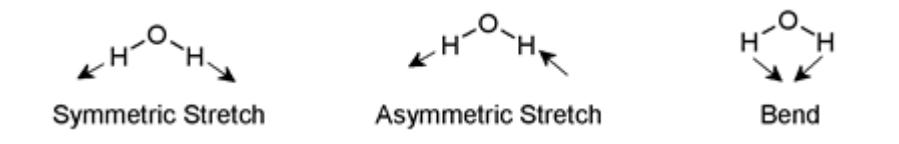

(lab8)=
# Lab 8 - Greenhouse Effect

Everyday the Earth receives energy from the Sun. On a daily basis the Earth reflects about 1/4th of the incoming solar radiation. The remainder is absorbed and contributes to warming the land, atmosphere and oceans. For the Earthʹs temperature to be steady and not rapidly heating or cooling, this absorbed energy must be very nearly balanced by energy radiated back to space in the infrared wavelengths. Luckily the amount radiated out in as infrared energy increases with the temperature of the earth, allowing us to reach steady states without over heating. The average temperature of the earthʹs surface, and our climate, is therefore determined by how effectively the infrared radiation coming from the warm surface of the earth can be reradiated into space. The reason that scientists are concerned about global warming at this time is because some human activities are making this re‐ radiation less effective. These human activities release molecules into the atmosphere which cause the radiated infrared radiation to reflect back down to the earthʹs surface, rather than escaping into space. Thus the atmosphere acts like the window on the ceiling of a greenhouse, which also causes infrared radiation coming from the plants inside to be trapped inside the greenhouse, keeping it warm in (mild) winters. So the effect of certain gases in the atmosphere which trap infrared radiation and cause the earthʹs surface to be warmer than it would otherwise be is called the greenhouse effect. Greenhouse gases are molecules such as carbon dioxide and water, which absorb and reradiate infrared radiation as the atoms in them vibrate against each other. The human activity which is having the biggest effect on this balance is the burning of fossil fuels which is releasing much more carbon dioxide into the atmosphere than was released in pre‐industrial times. Measurements confirm that the amount of carbon dioxide in the atmosphere is steadily rising and that the average temperature of the earthʹs surface is also rising. Because the climate is complicated and because other things can also cause the temperature to change there has been some discussion about whether the temperature rise is caused by the carbon dioxide increase. However in the last few years as a result of many measurements as well as extensive computational modeling, a very wide scientific consensus has emerged which attributes much of the observed temperature increase to the human activities leading to increased carbon dioxide in the atmosphere.

In the laboratory this week you will carry out an experiment in a model earth consisting of glass case (an empty aquarium) in which you measure the temperature at the bottom surface of the tank when it is heated with visible light (from a lamp, modeling the sun) first when there is no carbon dioxide in the tank, and again when the tank is filled with carbon dioxide.

- **Trial 1:** Aquarium 
- **Trial 2:** Aquarium with CO<sub>2</sub> 
- **Trial 3:** Aquarium with black paper on bottom 
- **Trial 4:** Aquarium with CO<sub>2</sub> and black paper on bottom 
- **Trial 5:** complex system (8oz. of coke in bottom)

## Equipment

5 gallon aquariums Dry ice for CO<sub>2</sub> Black Paper cut to fit bottom of aquarium Heat Lamp SaranWrap Can of Coke Vernier Capstone interface, temperature sensor and computer

## Prediction

Given the 5 models, predict possible outcomes for each of the systems, rank in order of highest to lowest equilibrium temperatures.

Do you think the tank with only CO<sub>2</sub> will have a higher equilibrium temperature than the tank with only black paper on the bottom?

How does the model that uses coke compare to the 4 previous trials, how does it differ?

## Warm‐up questions

- 1. What effect is the black paper going to have on the model system?
- 2. From your knowledge of CO<sub>2</sub>, what effect might it have on the system?
- 3. Do you think that the effects of the black paper and CO<sub>2</sub> gas will be additive? If so, why? If not, why?
- 4. What will Trial 5 be like? Is there another greenhouse gas other than CO<sub>2</sub> in this system? How about the color of the coke, how does that compare to the black paper?
- 5. Which of the 5 trials do you believe will have the hottest equilibrium temperature?

## Exploration

Familiarize yourself with the apparatus. When using dry ice to create CO<sub>2</sub> you will experience a certain amount of cooling, how can you minimize the effect on your data? It is useful to know that CO<sub>2</sub> is heavier than air, so it will sit in the aquarium like water in a bathtub if not disturbed too much

How much effect do you think the distance of the lamp from the aquarium surface will have on your results? How can you minimize this between the different lab groups?

How important is the temperature probe positioning? If the lamp directly shines on the probe, does this effect your measurements?

Make a plan that determines a good amount of time to collect data. How can you tell if your system has reached equilibrium?

## Measurement

Run the trials and collect temperature data for each setup.

If you are going to compare data as a class, the setup needs to be standardized so each of the lab groups has the exact same distance from the tank surface to the heat lamp bulb. The temperature probes should be shielded with a Styrofoam cup to keep the light from directly striking it.

## Analysis

List the equilibrium temperatures for each group and compare. Were the results you got for the coke trial what you expected?

## Conclusion

Changes in the vibrational and rotational motions of molecules are the main reason for the absorption of IR energy The direct absorption of infrared radiation occurs **only** if there is a **change in the dipole moment** of the molecule.

```{figure} ../figures/lab8/watervib.gif
:label: fig:lab8:watervib
:width: 100%
:align: center
:alt: Vibrational modes of water.
Vibrational modes of water.
```


Consider the dipole moment as the molecule undergoes each of these motions. The vibrations will result in an absorption in the infrared region. Infrared absorption frequencies for several atmospheric gases are given in [](#tab:lab8:IRabsorption).

```{table} Principal IR Absorptions for Various Atmospheric Gases
:label: tab:lab8:IRabsorption
:align: center
| Type of Gas                       | Absorption Ranges<br>(in cm<sup>-1</sup>)<br>[one peak<br>within the following<br>ranges.] | Type of bond causing absorption |                       |
|-----------------------------------|------------------------------------------------------------------------------------------|---------------------------------|-----------------------|
| Water<br>(H20)                    | 3800-3600                                                                                |                                 | Asymmetric<br>Stretch |
|                                   | 1600-1400                                                                                |                                 | Bend                  |
| Carbon Dioxide                    | 2400-2200                                                                                |                                 | Asymmetric<br>Stretch |
| (CO<sub>2</sub>)                             | 800-600                                                                                  |                                 | Bend                  |
| Nitrous Oxide<br>(N20)            | 2400-2200                                                                                |                                 | Symmetric<br>Stretch  |
|                                   | 1400-1200                                                                                |                                 | Asymmetric<br>Stretch |
| Carbon<br>Tetrachloride<br>(CCl4) | 1000-600                                                                                 |                                 | Asymmetric<br>Stretch |
| Ozone                             | 2400-2200                                                                                |                                 | Symmetric<br>Stretch  |
| (O3)                              | 1200-1000                                                                                |                                 | Asymmetric<br>Stretch |
| Methane<br>(CH4)                  | 3200-3000                                                                                |                                 | Asymmetric<br>Stretch |
|                                   | 1400-1200                                                                                |                                 | Bend                  |
| Nitric Oxide<br>(NO)              | 2000-1800                                                                                |
|                                 | Stretch               |
``` 
As an example, [](#fig:lab8:waterIR) shows the absorption of water. The broad absorption peak in the mid-3000s is obvious.
```{figure}
:label: fig:lab8:waterIR
:width: 100%
:align: center
:alt: Infrared absorption spectrum of water.
Infrared absorption spectrum of water.
```