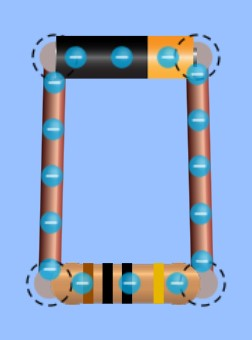
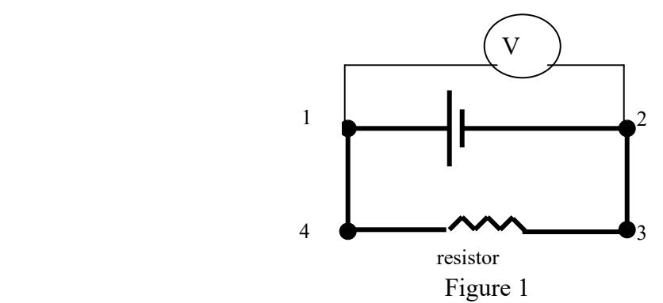
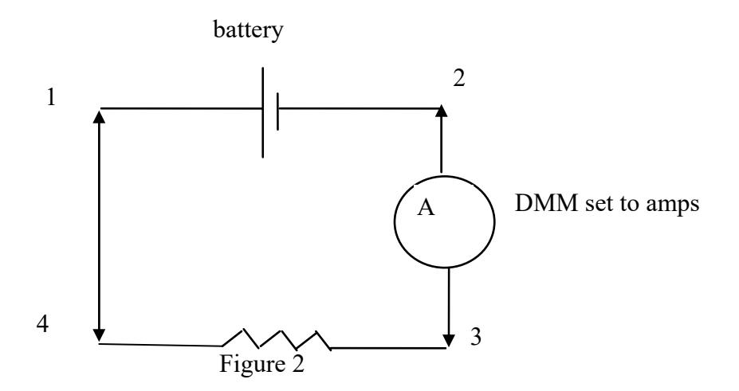

(lab9)=
# Lab 9 -Ohm's Law and Circuit Exploration

Toasters, televisions, computers, and flashlights all involve electric circuits. In a flashlight, for example, charge flows from a battery through a wire to a bulb. When the charge moves through the filament of the bulb, some energy is transferred to the filament. As a result, the filament heats up and radiates energy as light. The rate of charge flow is called *current.* One can only have charge flow (current) for an extended period of time if the charge has a closed circuit, or path to flow around. This is because electrical charge can never be created or destroyed. If the charge starts to flow and there is not a closed circuit, then it starts to build up somewhere, where the path it is following ends. The pileup of charge is accompanied by a buildup of stored energy and eventually the charge escapes by arcing, often destructively. The fact that charge never disappears in nature is another of the great conservation laws of physics.

A closed circuit involves charges leaving the positive terminal of a battery, passing through the wires or light bulbs, and returning to the negative terminal of the battery. The bulb acts as a *resistor* because it ʺresistsʺ the flow of charges. The bulbʹs resistance causes the filament inside to increase in temperature and start to glow. Your battery separates positive charges from negative charges within its structure. The work that is done to separate these charges increases their electrostatic potential energy, and a *voltage* difference is created.

The simplest circuit involves a resistor and battery connected in a single current path. When the batteryʹs voltage is increased and the resistance is held constant, the current increases. If the voltage is held constant and the resistance is decreased, the current should again increase because the flow of charges is not ʺresistedʺ as much as before. These relationships can be written as 
$$V = IR,$$
in which $V$ is voltage, $I$ is current, and $R$ is resistance. This is Ohmʹs Law. It holds for the resistors you will study in this laboratory, but it not for all possible circuit elements. In this exercise, you and your lab partners will investigate Ohmʹs Law by measuring voltage, current, and resistance in a simple closed circuit.

A simple resistor circuit is shown in   is a cartoon of the circuit drawn using the [PhET simulation](#phet:lab9:circuits) below.  is called a circuit diagram or schematic of the same resistor circuit that is in 
:::{figure}
:label: fig:9:resistorcircuit
:align: left

(resistorcircuita)=

(resistorcircuitb)=

A simple resistor circuit diagram.
:::

## Equipment

 * DC power supply or batteries
 * 2 digital multimeters 
 * light bulb
 * 3 resistors 
 * set of wires

## Predictions/preliminary questions

1. Suppose a voltmeter were connected across a battery to measure the voltage from point 1 to point 2. (See figure 1.) Suppose you moved the voltmeter and connected it from point 3 to point 4. Compare the **voltage** reading at the new location with the reading at the first location. Explain your reasoning.
2. Compare the **current** reading, in amps, on an ammeter connected between point 2 and point 3 with the reading on the ammeter if it were connected between points 1 and 4. (The ammeter is connected between the points so all the current runs through it. See figure 2.) Explain your reasoning.
3. If you were to double the voltage (for example, using two batteries) what would happen to the amount of **current** in the circuit if the resistance in the circuit stayed the same? (See figure 2)
4. If the resistor in the circuit were replaced with a resistor with twice the resistance, what would happen to the current in the circuit assuming you used the same battery with the same voltage?

#### Procedure

The first part of this exercise is to become familiarized with two quantities: voltage (known also as potential difference; measured in volts) and current (measured in amps). Voltage is the work done transferring one coulomb of charge from one place to another; you do not need a complete circuit to measure a potential difference.

The digital multimeter (DMM) has various settings to measure voltage. It also allows you to measure the current (Amps) by turning the switch to the ʺampsʺ or ʺmilliampsʺ settings. Furthermore, you can measure resistance by turning the switch to the ʺohmsʺ settings. See Appendix I for a more thorough description of how to use the DMM.

**When you set up a circuit in the lab with the necessary wires, meters, and resistors, etc. make the circuit look as simple as possible. Do not let the wires cross unless necessary. Keep the wires as straight as possible and as short as possible. Make the circuit so you can easily tell which objects are connected to each other.**

1. First, set the digital multimeter to measure volts and connect it across the terminals of the battery. Observe what happens as you change the range settings on the meter. Observe what happens when you reverse the connection. The meter adds a minus sign if the potential difference is reversed and indicates (by a blank screen) if the potential difference is too large to be measured. Choose a range where the most digits are displayed so that you will have the greatest precision in your measurements.
2. You can leave the multimeter connected across the battery terminals, but to measure the current through the circuit another meter must be connected in series with the resistor and the battery. Connect a complete circuit from the positive terminal of the battery, through a second multimeter (set to measure the current through the resistor), and back to the battery. The second multimeter is now able to measure current. Record the current and the voltage across the battery.
3. Disconnect the circuit. Set a multimeter to measure resistance, and connect it across the terminals of the resistor. Record the value of your resistor in ohms. Why must you disconnect the circuit before trying to measure the resistance of the resistor?
4. Repeat these steps several times, using a different resistor in the circuit each time. Also take measurements using a light bulb as the resistor. Be sure to take measurements of the resistance, voltage, and current for each circuit.

:::{iframe} https://phet.colorado.edu/sims/html/circuit-construction-kit-dc-virtual-lab/latest/circuit-construction-kit-dc-virtual-lab_en.html
:label: phet:lab9:circuits
:width: 100%
:align: center
:placeholder: ../figures/lab9/phetscreenshot.png
:::

#### Analysis

Record the values that you measured using the multimeter in a data table, similar to the one shown below. Also calculate theoretical resistances using your measurements for voltage and current (R=V/I) and then record your calculations. Tabulate your experimental and theoretical resistances for all the resistors and the bulb. Explain the values that you have obtained.

|            | Measured Voltage | Measured Current | Measured   | Calculated |
|------------|------------------|------------------|------------|------------|
|            | (in Volts)       | (in Amps)        | Resistance | Resistance |
|            |                  |                  | (in Ohms)  | (R = V/I)  |
| Resistor 1 |                  |                  |            |            |
| Resistor 2 |                  |                  |            |            |
| Resistor 3 |                  |                  |            |            |
| …          |                  |                  |            |            |
| Light Bulb |                  |                  |            |            |

# Conclusions

1. Compare the measured and calculated resistance values in your data table. How close are they? If there are differences, what are some possible reasons for these differences?

The German physicist Georg Ohm showed that, when the voltage across a resistor changes, the current through it changes. He expressed this relationship as: I = V R

Current is directly proportional to voltage and inversely proportional to resistance. In other words, as the voltage increases, so does the current. Ohm's Law also means that current is inversely proportional to resistance and voltage is directly proportional to resistance.

- 2. Superconductors are materials which, when cooled sufficiently, offer almost no resistance to electrical current. The copper wires in your circuits do, however, add to the total resistance.
  - a) What if the wires used in the circuit with the light bulb were replaced with superconducting wires and the resistance became almost nothing? Would the current in the circuit change, or the does voltage change, or both?

b) What would happen to the light bulb? Explain your answer using Ohm's law.