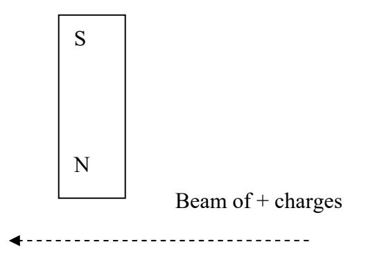
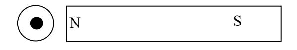
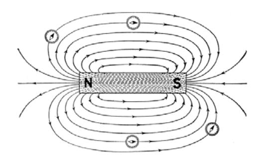
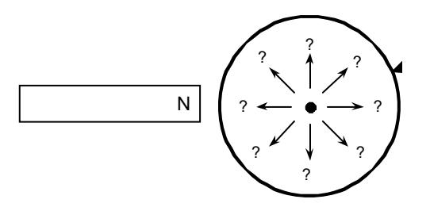

(lab10)=
# Lab 10 - Magnets and Moving Charges

The interaction of magnetism and electric charges underlies how motors and generators function. Motors and generators look very similar inside and are mechanically very similar. They work by closely related, but different principles. In this laboratory you will study the principle by which motors work in Part 1 and the principle by which generators work in part 2. Magnetic fields arise from magnetic materials and also from moving charges in the currents running in circuits or beams of electrically charged particles. The picture in most television sets is made by such beams (of electrons) which move from the back of the picture tube to the screen where they hit the screen and excite phosphors which make the light which you see. (Actually the magnetic fields arising from magnets can also be regarded as arising from moving microscopic currents inside the material.) If one has a magnetic field produced by one of these means (a magnet, a current carrying wire (often wound in a coil) or a charged beam) then if other moving electrical charges move through this magnetic field, the moving charges will experience a force. This force is what makes the rotor of an electric motor go around. To get an idea how that works you may study [http://hyperphysics.phy-astr.gsu.edu/hbase/magnetic/motorac.html](http://hyperphysics.phy-astr.gsu.edu/hbase/magnetic/motorac.html). The rotor (the thing that goes round and round ) in the motor has a wire in it that carries a current. The rotor moves in a magnetic field provided by two ʺpole magnetsʺ labeled N and S in the figure. Because the charges in the wire in the rotor are moving, they feel a force which pulls on the rotor and makes it turn. What is strange about this force is its direction: It is not in the direction of the magnetic field and it is not in the direction of the velocity of the moving charges but is perpendicular to both those directions as illustrated in [](#fig:lab10:lorentz). In part 1 of this laboratory, you will do some experiments using a magnet and the currents in a cathode ray tube (a simplified TV tube) to help you to understand this peculiar directional aspect of magnetic forces better.
```{figure} ../figures/lab10/LorentzForce.jpg
:label: fig:lab10:lorentz
:width: 100%
:align: center
:alt: (a) The Lorentz force on a moving charge due to a magnet is perpendicular to both the motion of the charge and the direction of the magnetic field. (b) The Lorentz force can be visualized using a cathode ray tube (CRT).
(a) The Lorentz force on a moving charge due to a magnet is perpendicular to both the motion of the charge and the direction of the magnetic field. (b) The Lorentz force can be visualized using a cathode ray tube (CRT).
```

Whereas in a motor, electrical energy is being converted into mechanical energy through the action of the forces arising from the motion of charges through magnetic fields, in a generator, mechanical energy is turned into electrical energy by magnets pushing charges into motion. That is possible because of a different principle illustrated in [http://hyperphysics.phy-astr.gsu.edu/hbase/magnetic/motorac.html](http://hyperphysics.phy-astr.gsu.edu/hbase/magnetic/motorac.html), Notice that Figures 11.10 and 11.7 look very similar. You should make sure you understand how they are different. In 11.10, illustrating a generator, the wire, which does not have a current being forced through it by an external battery, is being mechanically forced to turn by forces exerted on some kind of a handle on the shaft. As a result, the magnetic field through the coil is changing. The new principle is that a changing magnetic field through a coil will cause a voltage in the coil to develop and then a current will flow. (This principle is a form of what physicists call Faradayʹs law.) In part 2 of this laboratory you will explore this principle by moving a magnet around a coil of wire and observing the resulting currents. Then you will construct and measure aspects of the operation of a simple generator, operating on the same principles as the one sketched in Figure 11.10, but different in some details.

## Pre‐lab reading

Hinrichs and Kleinbach pp 359‐372

## Part 1. the principle by which motors work: the effect of a magnetic field on a moving charge

### Equipment

- 1 cathode ray tube (CRT)
- 1 high‐voltage power supply
- 3 bar magnets
- 1 compass

### Predictions/preliminary questions

1. If a beam of positively charged particles moves from right to left as shown in the figure below what would be the effect of a bar magnet on the beam if it were located as shown in the diagram? (Would the beam move up? down? Out of the paper? Into the paper? Or, would there be no effect?)



2. If the beam of particles, in the above diagram, were electrons (negative charges) what would be the effect of the magnet on the beam? (Would the beam move up? Down? Out of the paper? Into the paper? Or, would there be no effect?)
3. If a beam of positive charges were coming out of the paper what would be the effect of the magnet on the beam? (The black dot represents the beam coming out of the paper.) Would the beam move up? down? Out of the paper? Into the paper? Left? Right? Or, would there be no effect?)



# Procedure

A cathode ray tube (CRT) produces an electron beam that can be seen as a glowing spot when it hits a phosphorescent surface inside the tube. Holding a magnet close to the CRT produces a magnetic field in the tube and causes the electron beam to deflect, which will make the spot on the phosphorescent screen move. The lab instructor will show you how to connect the CRT to the high‐ voltage power supply properly.


*You and your partners will work with equipment that produces large voltages, and improper use can cause injury. To avoid danger, the power should be off and you should wait at least one minute before any wires are connected to or disconnected from the power supply. Do not grasp a wire by its metal ends.*

1. How do you think the electron beam will be deflected in the presence of a magnetic field? Record your predictions in your notebook.
2. Connect the CRT and the power supply. Consult with your instructor about the ideal accelerating voltage with which to start the exercise. Record this value. Also record the location of the non‐deflected beam spot on the screen.
3. Use your compass to determine which pole on your bar magnet is the north magnetic pole. Below is the magnetic field that is produced by a bar magnet:



Based on this, describe what the magnetic field will be like within the CRT.

4. Place the magnet at the side of the CRT. In what direction does the beam deflect? Does the deflection of the beam match your prediction? Why or why not? Repeat the procedure for the south pole. Should there be a difference? Why or why not?
5. If you position a bar magnet at the front of the screen of the CRT, do you see any deflection? What does the right hand rule predict? Try this with both poles of the bar magnet. What are the results? Are they what you expected? Can you orient the bar magnet so that it attracts or repels the electron beam?
6. Place the north pole of your magnet a fixed distance from the side of the CRT screen. Record the initial deflection of the beam. Increase the electronsʹ speed by increasing the accelerating voltage as much as possible.

**Caution: always turn off the power supply and wait a 10 seconds before removing and reconnecting wires, or you could get a dangerous shock! never grasp a wire by its metal end.**

How much does the deflection change? Try with both poles of the magnet. Were the results what you anticipated?

7. Place the north pole of the bar magnet a fixed distance from the side of the CRT near the screen. Record the initial deflection. Increase the magnetic field by adding more magnets. Also try the south poles. Was the result what you would expect?
8. What effect does Earthʹs magnetic field have on the CRT electron beam? What is the direction of Earthʹs magnetic field in your lab room? Based on your earlier findings, orient the CRT to see the maximum effect. Also orient it for the minimum effect. Is there also an effect on the beam from Earthʹs gravitational field?

### Conclusions

1. When you bring the north end of a bar magnet near the side of the CRT:



	- a) in what direction is the electron beam deflected?
	- b) Does the beam deflection increase or decrease as your magnet is moved closer to the CRT?
	- c) Does the beam deflection increase or decrease as the magnetic field strength increases? How can you tell?
	- d) Is the direction different for the south end of the magnet?
2. The electron beam in a television is ʺsteeredʺ with magnetic fields.
	- a) What is the direction of the field that pushes the electrons up and down? (Draw a sketch and use words to explain it.)
	- b) What is the direction of the field that pushes the electrons left and right? (Draw a sketch and use words to explain it.)
3. In the future, the use of superconductors will allow construction of smaller, lighter, and more efficient generators and motors. In a superconductor, there is no resistance to the flow of electrons. This has two effects: (1) no energy is lost in the form of heat, and (2) the velocity of the electrons would be greater.
	- a) Does the deflection of an electron beam in a magnetic field depend on the speed of the electrons?
	- b) Discuss what effects a higher electron velocity in the wires of a generator and a motor would have.

## Part 2. the principle by which generators work: the effect of a changing magnetic field on the voltage in a coil

In the previous part of this laboratory you studied the way in which forces are exerted on moving charges, either in a beam or in a wire, when they move through a magnetic field. That is the principle by which motors work. (The magnetic force is sometimes called the Lorentz force.) In this part of the laboratory you will study how a changing magnetic field can cause the charges in a wire which has no current flowing in it to start moving, thus producing a current, as a result of the changing magnetic field. This principle is a version of Faradayʹs law. In generators it is used to produce a current by mechanically forcing a wire coil to move through a stationary magnetic field (as in Figure 11.10 of your book) or by magnetically causing a magnet to move in and out of a coil (as in the simple generator you will build in the laboratory.)

In the first part of the exercise, you and your lab partners will investigate the currents and voltages which are induced in wire coils when the magnetic fields around them change in time. Then you will construct a simple generator using which uses Faradayʹs law to convert mechanical to electrical energy.

### Equipment

- 1 long wire solenoid
- 1 short wire solenoid
- 1 digital multimeter
- 3 neodymium magnets
- 1 roll of masking tape
- 1 pencil or wood dowel
- 1 compass

### Predictions/preliminary questions

1. What, if anything, happens to the charges inside a coil of wire when a magnet moves through the coil? What happens to the charges if the magnet is close to the coil but not moving?
2. Does the same thing happen to the charges if you move the North end of a magnet toward a coil of wire as when you move the South end toward the coil? Explain your reasoning. Does the speed at which the magnet moves make a difference?
3. What happens to charges in the wire if you hold the permanent magnet stationary and move the coil?

### Procedure

In this exercise, you and your partners will use a permanent magnet to produce changing magnetic fields. This causes an electric field to be produced, which you will detect using a solenoid (a spool of wire) connected to a multimeter. The electric field drives electrons around the solenoid, producing a current that can be detected by the multimeter. Consult Appendix I at the back of this manual for information about the use of your multimeter. If you still have difficulties, ask your instructor for assistance.

1. Use a compass to determine which ends of the magnets are north and which are south. Keep in mind a compass needle is a lightweight magnet balanced on a pivot point, but the end labeled as north points to Earth's magnetic north pole.
2. Start with the longer wire solenoid ‐‐ it has more loops of wire than the other one. Do you detect any current with your digital multimeter when a magnet is simply placed at rest inside the solenoid? Try the lowest setting to measure current.
3. Do you detect any current when you move the magnet or wiggle it inside the solenoid or near it? What happens if you change the speed at which you move the magnet? If you reverse the direction of the magnetʹs poles, what happens?
4. What happens if you hold the magnet still and move the solenoid? What happens if you change the speed at which you move the solenoid? What happens if you reverse the direction of the magnetʹs poles?
5. What happens when you repeat the above steps with second magnets? With three?
6. Now you and your partners will construct a generator. Tape a magnet securely to the end of a pencil so that its looks like the head of a hammer. Mark the north and south poles of the magnet (if not marked already) for later reference. Rotate the pencil near the solenoid and observe the induced current with the digital multimeter. Change the orientation of the pencil and note its effect on the current. Which orientation induces the largest current? The smallest current?
7. If you change the speed at which you rotate the pencil near the solenoid, does it have any effect on the ʺamplitudeʺ of the induced current?
8. Use the second wire solenoid with the same diameter but fewer loops. Compare the strength of the induced current in the two solenoids.
9. How does the current produced by your generator change with the distance of the bar magnet?

### Conclusions

1. What factors affect the induced current in the wires?
2. In this exercise, you and your partners used a magnetic field to induce a current. In the previous exercise, you and your partners used a current to produce a magnetic field. How do the factors that affected the magnetic field in the previous exercise compare to the factors in this exercise?
3. Based on your experience in this exercise and the previous one:
	- a. describe how an electric generator works. (What basic components are needed? What needs to happen with these components?)
	- b. Describe how this happens for each of the following sources of electricity: solar, geothermal, hydroelectric, tidal, wind, and nuclear power.
4. Based on what you know about generators and motors, how could you convert your generator in this exercise into a motor?