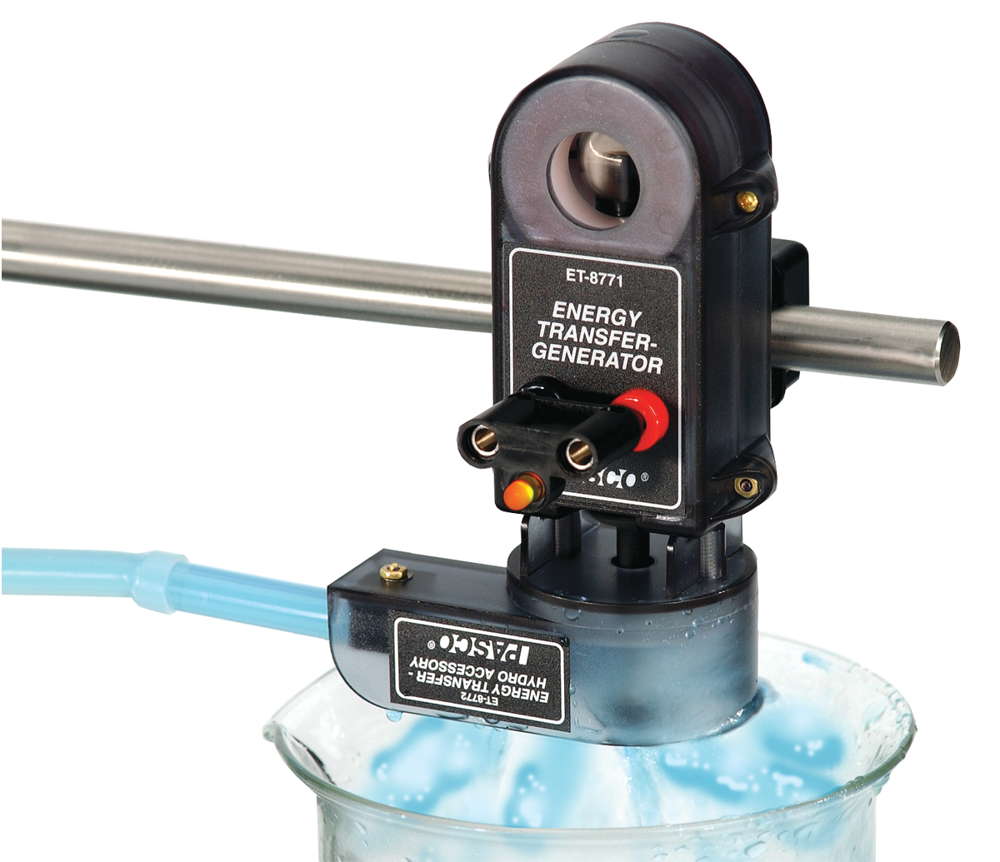
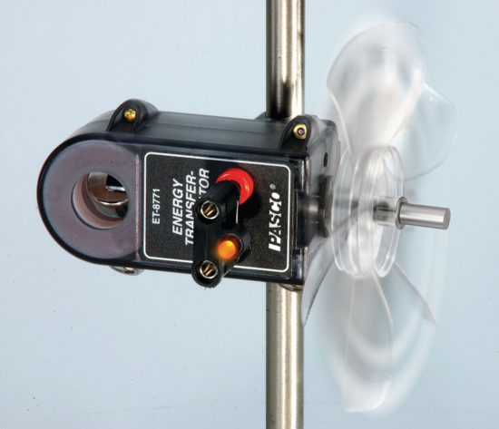

(lab11)=
# Lab 11 - Conversion of gravitational potential and wind energy to electrical power: hydro and wind power

Now that you have some familiarity with the way an electrical generator works, you will use a somewhat more sophisticated generator to study how effectively it converts the gravitational potential energy of water lifted above the earthʹs surface (in applications, above sea level) to electrical energy. As discussed in your book, this source supplies about 3 % of the US electricity supply (using the water stored behind dams to drive turbines which turn generators.) It is ultimately a form of solar energy because the water gets into the rivers and flows into the dams through the collection of rain and snow falling on mountains and other highlands. The rain, in turn arises because the heating of the ocean surface by the sun evaporates water which rises as vapor to the clouds and is dropped as rain on the mountains. Unfortunately most of the promising sites for hydropower plants are already developed in the United States, and constructing new dams has some negative environmental consequences, so there are not prospects for strong growth in this energy sector in the United States.

You will use the same generator to study the effectiveness of the generation of electrical energy from the wind. Wind energy is also partly due to solar heating of the atmosphere, but the wind is partly extracting energy from the kinetic energy of the earthʹs rotation. Wind energy generation is a rapidly growing industry in the United States and Europe and can supply a significant portion of electrical energy needs in the future (10% or more).

# Pre‐lab reading

Textbook sections 8.4 and 8.6

## Equipment

1. Generator Assembly 
2. Resistor Plug 
4. LED Plug
5. Spool of thread
6. Hydro Turbine
7. Wind Turbine

## Predictions/preliminary questions

```{figure} ../figures/lab11/Pascogenerator.svg
:label: fig:lab11:Pascogenerator
:width: 100%
:align: center
:alt: Pasco electricity generator.
Pasco electricity generator
```

If you have 500 cubic centimeters of water an average height of 0.5 meters above the turbine, what is the maximum energy which you can generate with the available energy? If there is a 100 ohm resistor across the output terminals of the generator, and the water takes a minute to run through the turbine, what is the average voltage which you expect to see across the output terminals of the generator? Electrical power in Watts is Volts squared divided by resistance in Ohms ($P = V^2/R$)

## Procedure part 1. electrical energy from gravitational: potential energy of a weight.

First use the generator to convert the gravitational potential energy of a weight to electrical energy. You will do one qualitative experiment in which the electrical energy is converted to light and a second experiment in which you measure the output energy quantitatively.
```{figure} ../figures/lab11/Pascogenparts.svg
:label: fig:lab11:Pascogenparts
:width: 75%
:align: center
:alt: Pasco electricity generator with various components.
Pasco electricity generator with various components
```

1. Use the rod clamp on the side of the generator to mount the generator to a rod stand.
2. Insert the LED plug into the jacks on the generator ([](#fig:lab11:Pascogenerator) and [](#fig:lab11:Pascogenparts)).
3. To attach the pulley, align the indent marks on the pulley with the indented portion of the black shaft on the generator; then slide the pulley onto the shaft. Fasten the nut tight over the screw to hold the pulley in place.
4. Place a small piece of no‐bounce foam underneath the hanging mass .
5. Cut a piece of string to tie to the hanging mass and pulley ([](#fig:lab11:Pascogenerator) and [](#fig:lab11:Pascogenparts)).
6. Tie a double knot in the string and hook the knot in the slot on the pulley.
7. Attach the other end of the string to the hanging mass.
8. Wind the string up on the smallest pulley, such that the string falls out when the mass reaches the bottom of the foam pad.
9. Adjust the position of the hanging mass or the height of the generator so that the knot slips out just as the mass reaches the foam.)
10. Now wind up the string and let the mass fall, observing the light emitted by the light emitting diode. You will see it changing from green to red and back, corresponding to current flowing in one direction and then in the opposite direction. This implies the generator is AC (alternating current). Does the rate at which the light changes from green to red and back change as the weight falls? Note the answer in your notebook, together with a brief discussion of the possible reason for any changes.
11. Now for the quantitative measurement, remove the LED plug and insert the resistor plug into the jacks on the generator. Your instructor will show you how to attach a voltage probe to the resistor jacks and to the computer and to use the software Capstone to make a graph of the power coming out of the generator at each moment in time. The instructor will also explain how to get the total electrical energy produced during the fall from the power data plotted on the screen. Note the total energy in your notebook and make a sketch of the graph of voltage versus time. See [](#fig:lab11:capstonedata)
12. Measure the distance which the weight fell and note it in your notebook and weigh the weight to determine its mass (if it is not marked on the weight) and make a note of it.
13. Repeat the measurement to ensure you get consistent voltage values each time.
```{figure} ../figures/lab11/capstone_data.png
:label: fig:lab11:capstonedata
:width: 100%
:align: center
:alt: A graph of the voltage produced by the electric generator.
A graph of the voltage produced by the electric generator.
```

## Part 2. Electrical Energy from Gravitational Potential Energy of Water

:::{figure}
:label: fig:lab11:Pascogenaccessories
:align: center

(hydroaccessory)=

(windaccessory)=


Pasco electricity generator with various components
:::

1. Attach the ET‐Hydro accessory housing to the molded case of the generator using the two captured screws and the supplied screwdriver
2. Insert the pointed end of a plastic nozzle into the spring clip underneath the housing
3. Connect the nozzle to a piece of tubing connected to an external water supply. Have a beaker or container below the housing to collect water exiting the turbine.
4. Run the water supply through the nozzle of the turbine and watch the turbine spin.
5. Shut off the water with the valve and refill the water container. Measure the vertical distance from the top of the water in the can to the turbine. Make this height similar to the height the mass fell in the previous section. With the resistance plug in the generator, connect the voltage detector measure voltage output as you did in Part 1.
6. To start taking voltage data, open the valve and let the water run out through the turbine. Determine and record the voltage output in your notebook.
7. Repeat the measurement to ensure you get consistent voltage values each time.
```{figure} ../figures/lab11/hydroattachment.png
:label: fig:lab11:hydroenergysetup
:width: 75%
:align: center
:alt: Pasco electricity generator with hydro attachment set up.
Pasco electricity generator with hydro attachment set up.
```

## Part 3. Electrical Energy from Wind Energy

1. Remove the turbine from the generator and attach the windmill assembly.
2. Blow on the windmill. Observe the windmill turning.
3. Measure the voltage output.

```{figure} ../figures/lab11/windturbine.png
:label: fig:lab11:windturbine
:width: 75%
:align: center
:alt: Pasco electricity generator with wind turbine attachment set up.
Pasco electricity generator with wind turbine attachment set up.
```

### Analysis

Voltage is not power, but it is proportional to power. Compare the voltage output of the three types of energy generation.

### Conclusions

Compare the three different voltage measurements and discuss the reasons for any differences in output you observed.