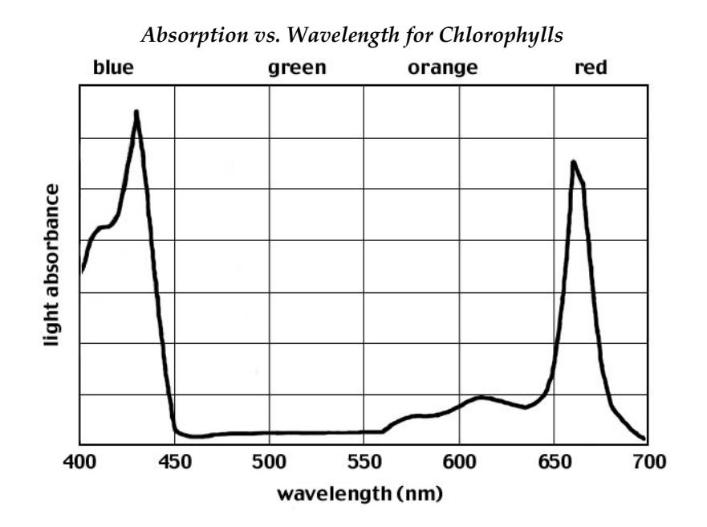

(lab12)=
# Lab 12 - Energy and Atomic Spectra

It turns out that the principles which govern the operation of generators and motors also allow for the existence of waves of electrical and magnetic fields propagating in space and carrying energy. When this was first discovered in the nineteenth century (by Maxwell on the theoretical side and by Hertz experimentally) then people realized for the first time that the light by which we see is an electromagnetic wave. From the point of view of energy technologies, light is important as a source of energy for solar energy devices and from the point of view of climate change, it is important in understanding the temperature of the earthʹs surface which is determined by a balance of energy flows of which the incoming electromagnetic wave flow from the sun and the outgoing infrared radiation are dominant.

The use of solar radiation to generate useful energy proceeds by three major pathways. One is direct conversion to thermal energy, which has been discussed earlier. Another is the use of solar radiation to produce electrical energy in photovoltaic cells (as in solar powered calculators) and the third is in the conversion of the energy of solar radiation to chemical energy in plants. The conversion of solar electromagnetic radiation to chemical energy in plants is not only the source of the energy in food and bio‐fuel but is also the source of energy in fossil fuels, which store the energy converted in this way by plants which lived millions of years ago. Of course electromagnetic waves are also central to many information technologies, such as radio, TV, and cell phones.

To understand more fully how these various conversions of solar radiation to other forms works, one has to introduce the idea of the spectrum of light and to discuss the nature of waves in a little more detail. A wave is a disturbance in a medium or the vacuum of space which is characterized by a propagation speed, a frequency and a wavelength ([](#fig:lab12:travelingwave)) In a traveling wave (the kind we will mainly consider) the speed is the speed at which the bumps in the wave move in the direction of travel. The wavelength is the distance between the bumps on the top of the wave and the frequency is one over the time that passes between the moments when successive bumps pass some fixed point in space. The three quantities are related by

$$\text{speed~=~wavelength~x~frequency}$$

:::{figure} ../figures/lab12/traveling_wave.mp4
:label: fig:lab12:travelingwave
:width: 100%
:align: center
A traveling wave with a wavelength of $\lambda = 2\pi~{\rm m}$ and a speed of $c=1.0~{\rm m/s}$. Notice the wavelength shown as a double arrow is constant for the wave regardless of the position of the wave.
:::

Wave speed is characteristic of the type of wave and the medium in which it is propagating. It does not depend on the wavelength or the frequency. Therefore, from the previous equation, for a given medium and type of wave, once you know the wavelength you know the frequency and vice versa. The other important feature of a wave is the amplitude of the wave, which is the height of the bumps, and which determines how much energy the wave is carrying. Solar radiation consists of electromagnetic waves, which travel in vacuum at a universal (and very high) speed of 3x10<sup>8</sup> m/s. It is a mixture of waves at different frequencies and wavelengths however. The color which we see in lighted objects arises because our eyes distinguish between electromagnetic radiation of different wavelengths. We see longer wavelengths of light as red and shorter ones as blue with the other colors appears as yellow, green, purple etc depending on wavelength. We canʹt see all the electromagnetic radiation which exists with our eyes however. The waves which carry cell phone, TV and radio signals are of longer wavelength and our eyes do not detect them and we also canʹt see ultraviolet and X-ray radiation which are electromagnetic waves of shorter wavelengths than we can see ([](#fig:lab12:electromagneticspectrum)) You can be convinced that solar radiation is a mixture of different wavelengths by using a prism to split the light into a rainbow of different colors, an experiment first done by Newton. In a more quantitative experiment, one can use an instrument to measure how bright the light at each color (that is, how much energy is coming in at each color). Making a graph of this measurement as a function of wavelength gives the quantitative ʹspectrumʹ of the light.
```{figure} ../figures/lab12/electromagneticspectrum.jpg
:label: fig:lab12:electromagneticspectrum
:width: 100%
:align: center
:alt: The electromagnetic spectrum.
The electromagnetic spectrum.
```

Looking more closely at such spectra, one finds that they consist of two different types of features. There is a smoothly varying background as well as some sharp peaks. You can see hints of the sharp peaks in [](#fig:lab12:solarspectrum). The shape of the smooth background tells you the temperature of the source (a very high 5800 kelvin degrees for the sun) and the peaks are characteristic of the atoms present in the sun. These so-called ʹline spectraʹ were first discovered about 100 years ago. They serve as a fingerprint of the chemical composition of the source and have been used to learn the composition of the stars by astronomers. In this laboratory, you will observe the spectra of sources made of various elements in the periodic table, in order to get an idea how the spectra vary depending on the chemical composition of the source.
```{figure} ../figures/lab12/solarspectrum.png
:label: fig:lab12:solarspectrum
:width: 100%
:align: center
:alt: The solar spectrum. The temperature-related blackbody smooth curve is shown over the jagged peaks related to atoms in the sun.
The solar spectrum. The temperature-related blackbody smooth curve is shown over the jagged peaks related to atoms in the sun.
```

The reason why atoms give out line spectral is because the electrons which move around the heavy nuclei of the atoms can only move in certain ways. When they jump from one mode of motion to another, they emit radiation characteristic of the difference between the rates at which they orbit the nucleus in the two modes.

Just as materials which are emitting electromagnetic energy do so only at certain well defined wavelengths, so materials can only absorb electromagnetic radiation at certain wavelengths. Thus one can also observe absorption spectra, which tell you which radiation failed to get through the material. The absorption spectrum of chlorophyll, which is the material in plants which harvests sunlight for conversion to chemical energy, is shown below. Chlorophylls absorb only certain portions of the visible spectrum: the blue-violet range (420-460 nm) and the red range (630-660 nm). The other colors, particularly green, are not absorbed by the chlorophylls and are reflected. Because plants therefore reflect green light to our eyes, we see them as green in color.



## Examples of Atomic Spectra
We show some characteristic emission spectra of gases of atoms of the periodic table in [](#fig:lab12:atomicspecra).

```{figure} ../figures/lab12/_page_60_Figure_2.jpeg
:label: fig:lab12:atomicspectra
:width: 100%
:align: center
:alt: Emission spectra of lithium, beryllium, sulfur, and potassium.
Emission spectra of lithium, beryllium, sulfur, and potassium.
```

You and your partners will view the atomic spectra of several different elements. You will record the characteristic spectrum for each element. Using the periodic table and your observations, you and your lab partners will get some understanding of the role of electron energy levels in creating atomic spectra.

## Equipment

- 1 handheld quantitative spectrometer (per student)
- 1 small strip of diffraction grating (per student)
- 1 high‐voltage power supply (per class)
- 1 set of spark tubes filled with different gases (per class)

## Predictions/preliminary questions

Some useful resources are
* [Blackbody spectrum simulation](https://phet.colorado.edu/sims/html/blackbody-spectrum/latest/blackbody-spectrum_all.html)
* [Molecules and Light Simulation](https://phet.colorado.edu/sims/html/molecules-and-light/latest/molecules-and-light_all.html)
* [Periodic Table of Elements](www.webelements.com)

- 1. What are electromagnetic waves? What is electromagnetic radiation?
- 2. What do we suggest an electron, within an atom, does when the atom produces a certain color in the spectrum?
- 3. In terms of **electrons** what is a difference between atoms of one element and atoms of another element that produce spectra that are very different? Compare for example an atom with a complex emission spectrum and an atom with a spectrum having only a few lines in its spectrum.

## Procedure

You and the rest of the class will observe and record the spectra emitted from a series of different elements. The spectra are your data for this exercise. From your observations, you will get some insight into the role of electron energy levels in creating spectra.

1. The elements you will observe first are gaseous and are contained in spark tubes. The spark tubes will allow us to excite the electrons of these gases. The electrons in a gas can be excited by running an electric current through the gas. The electricity will be supplied by a high‐voltage power supply; it is similar to the equipment that is used in ʺneonʺ signs. A spark tube is placed within an electric circuit, and an electric current is run through the circuit. The gas within the tube is excited, and as a result, light of specific wavelengths is emitted. The lab instructor will handle the spark tubes as they are fragile and involve high voltage.
2. Instead of using a prism to spread out the emitted light, you will use a spectrometer with a thin piece of plastic called a diffraction grating. It is essentially a plastic slide with a large number of evenly spaced parallel grooves. The grooves are very fine, with 4000 to 8000 lines per centimeter. When you hold the spectrometer in front of your eye, you will see the light from the windows and the overhead lights spread out into a rainbow. The scale indicates the wavelengths of the light you see. To cut out this extraneous light, the shades will be pulled down and the lights turned off.
3. Your instructor will put spark tubes with different gases in the power supply. **Observe the spectrum of each and record it as accurately as possible. Note the color, brightness, spacing, and number of the lines.**
4. Before using the spectrometer look at the light from the fluorescent lights and light from the spark tubes using a **diffraction grating that looks like just a piece of plastic. You should see a spectrum off to one side ‐ in fact, you can probably see a spectrum off to the left and to the right.
5. To use the blue spectrometer, hold it with the writing up and point the rectangular opening (located on the right side) toward the light source. Look through the eyepiece in the smaller end. There is a note about calibration, on the spectrometer, close to the eyepiece: Point the rectangular opening toward a fluorescent light and rotate the small plastic eyepiece until the green line is aligned with the mark at 546 nm. Then it should be ready to use if you don't adjust the eyepiece any more.
6. Observe the spectra and try to identify the elements. On your computer desk top open "The Elements Spectra" you can use this program to obtain the spectra of the elements. Click on one of the elements in the periodic table to see the spectrum. The program shows both the absorption spectrum and the emission spectrum that you see looking through the spectrometer. The most noticeable or significant lines in the absorption spectrum are probably the easiest ones for you to see in an emission spectrum.
7. Your instructor may show you the spectra from the gas tubes using a special spectrometer that can be used to project the spectra on the screen.
8. Examine a periodic table of the elements and the simulations above. Use this information to help answer the questions in the conclusion.

## Conclusions

1. 
	* a) Describe why light emitted by a particular *electron* would have only a *specific* set of energies.
	* b) Which of the elements had the fewest spectral lines? Which element had the most?
	* c) What causes the complexity of the spectra? Explain in detail. (Remember that if there are more protons in the nucleus of an atom, there are more electrons and therefore more available levels for the electrons to populate.)
2. The equipment used in this exercise is very similar to that used in ʺneonʺ signs. Use your knowledge of atomic theory and explain how you think all of the different colors in ʺneonʺ signs are made ‐‐ feel free to look up more information on the web to answer this one.
3. Identification of elements by spectra lines is often employed in environmental science. In particular, it is used in the fields of environmental contaminants, atmospheric chemistry, hydrology, waste management, soil chemistry, and various others. In addition, it used by other scientists. For instance, astronomers use spectra to investigate stars, and geologists use them to investigate microscopic variations in minerals. Can you think of some other applications of atomic spectra? Explain your answers.