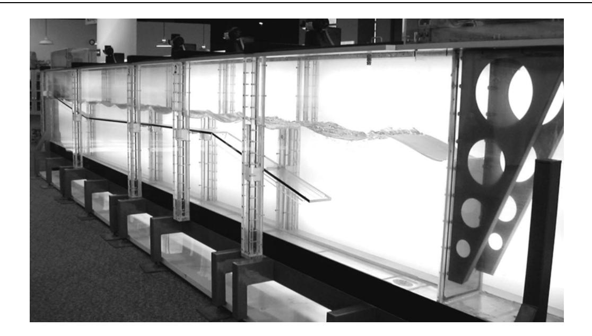

(lab14)=
# Lab 14 - Harvesting Energy from Water Waves

In this laboratory you will explore a method of generating energy from ocean waves. Countries like Great Britain are actively investigating the use of waves as an alternative to existing methods of electrical generation. Over two hundred designs have been studied under the United Kingdomʹs wave energy program. Most of the wave energy converter designs were tested as small‐scale models ‐‐ only a few were constructed as large‐scale generators.

Small‐scale models allow engineers to study how various phenomena affect the behavior of ocean waves. The most promising types of wave energy designs were several that channeled waves with artificial structures to increase their height (or amplitude) and thus the energy available from them.

It has been estimated that total amount of power released by waves along the worldʹs coasts is between two and three million megawatts. This is equivalent to the output of 3000 large power plants. Yet this vast amount of energy is spread out over thousands of kilometers of coastline. In favorable locations, however, the energy density can be 65 megawatts per mile of coastline, which can lead to economical electricity production. It is even more favorable if large waves can be channeled, drastically increasing the height of the waves. The waves are then directed toward heaving devices, which use the vertical motion of the waves to produce electricity. Such a wave‐ focusing facility has been in operation along the North Sea coast of Norway since 1986, and it commonly generates 350 kilowatts.

In this exercise, you and your partners will use differently shaped blocks in a tray of water to explore how artificial structures can increase the height of ocean waves. The objective is to present a model of how to channel and maximize the height of ocean waves for a new heaving wave energy power plant under construction.

#### Pre‐lab reading

Your text does not include a section on the utilization of ocean wave energy for electrical power generation. Read the Wikipedia article :

http://en.wikipedia.org/wiki/Wave\_power

# Equipment

- 1 set of shaped blocks
- 1 water tray
- 1 wave generator (pencil or finger)
- 1 ruler to measure wave height
- Wave demonstrator from demo

# Predictions/preliminary questions

- 1. Refer to Figure 4.14 of your book to remind yourself of some fundamental properties of all waves. (That section of the book is about electromagnetic waves but the concepts of wavelength, frequency, amplitude and velocity illustrated there can also be used to discuss water waves.) Why do we say that the energy carried by a water wave increases as its amplitude increases? (Think about gravitational potential energy of the water.)
- 2. How would you extract the energy in this wave to do useful work, such as generating electricity? Think of some kind of piston which the wave strikes. See if you can invent a way

to set up such a piston so that it would drive a generator or otherwise extract the energy. say by lifting a weight.

- 3. Now itʹs claimed that increasing the height of the wave would be good in an ocean wave generator. Why? Can you increase the total energy in the wave by making structures to channel the wave? (Remember the conservation of energy). If the total energy in the wave does not increase due to channeling what other reason might there be to channel the wave? Would channeling the wave increase the wave amplitude? (Think about conservation of energy again.) Can you think of reasons why it might be easier to extract the energy from a wave with a large amplitude and a small width (because of channeling) than from the original wave coming in from the ocean?
- 4. Draw two or three sketches showing how artificial structures could be used to increase the height of ocean waves so they could more effectively produce useable power.
- 5. Give some reasons why you think your structures would work.

#### Procedure

Your goal in this exercise is to use the provided set of differently shaped blocks to increase the amplitude of the water waves as much as possible. Keep in mind that mechanical waves obey Newtonʹs Laws and the work‐energy theorem, which you investigated in Lab #2. How can you use this information to achieve your goal of maximum amplitude?

Place the wave generator at the edge of the tray. Arrange the blocks in the tray in an effort to maximize the wave amplitude at some point on the opposite edge of the tray. With each arrangement, record what you did, your reasoning for it, and the physics principles involved. Also measure the resulting height of the wave with a ruler. Draw illustrations of each of the arrangements as well. What did you observe in each arrangement?

Be creative with what you try, but also think critically about each arrangement. What is the maximum amplitude you were able to produce? How much of an increase is this over the amplitude of the waves without any blocks in the tray?

Did you and your partners figure out how to create waves with the greatest possible height? Here are two ways to determine if you did. First, check out tsunamis (Japanese for ʺharbor wave,ʺ also called tidal waves) on the Internet. Why are tsunamis so large (as high as 30 m)? What happens when a tsunami when it approaches the shore? The Science Museum of Minnesota, has the wave tank shown below. Can you suggest how to manipulate the controls so that the wave height is greatest at the far end of the tank? How is energy involved? If you get a chance, you might like to visit the museum yourself and try it (not required!).

#### Conclusions

- 1. As mentioned above, artificial structures are employed to channel large ocean waves and drastically increase their height. These heightened waves are then directed toward heaving devices, which use the vertical motion of the waves to produce electricity. What would you recommend to the designers of these artificial structures? What arrangement of structures would result in maximum amplitude at a heaving device?
- 2. A concern with the use of artificial structures to channel waves is that they change patterns of erosion and sedimentation. There is more erosion where the waves are concentrated and more sedimentation in adjacent areas. Environmentalists are concerned that the changes in erosion and sedimentation could have negative effects on local ecosystems. Based on your observations, are there ways to increase the wave height in a small region (where a heaving device would be positioned) while the wave height remains largely unchanged elsewhere?
