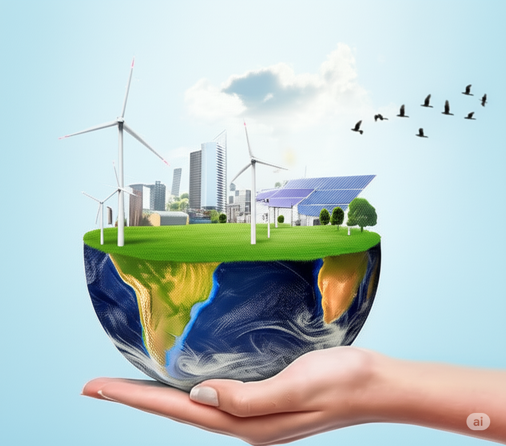

(introduction)=
# Introduction

| [Introduction](#introduction) |                                                   |
|:------------------------------|:--------------------------------------------------|
|    [Lab 1](#lab1)             | Velocity and Acceleration                         |
|    [Lab 2](#lab2)             | Velocity, Acceleration and Newton's Second Law    |
|    [Lab 3](#lab3)             | Conservation of Energy                            |
|    [Lab 4](#lab4)             | Energy Transfer Through Work                      |
|    [Lab 5](#lab5)             | Heat and Insulation                               |
|    [Lab 6](#lab6)             | Heat, Solar Input and the Earth's Available Energy|
|    [Lab 7](#lab7)             | Mechanical and Thermal Energy                     |
|    [Lab 8](#lab8)             | Greenhouse Effect                                 |
|    [Lab 9](#lab9)             | Ohm's Law and Circuit Exploration                 |
|    [Lab 10](#lab10)           | Magnets and Moving Charges                        |
|    [Lab 11](#lab11)           | Conversion of Gravitational Potential and Wind Energy to Electrical Power|
|    [Lab 12](#lab12)           | nergy and Atomic Spectra                          |
|    [Lab 13](#lab13)           | Half-Life and Radioactive Waste Storage           |
|    [Lab 14](#lab14)           | Harvesting Energy from Water Waves                |
|    Appendices:                |                                                   |
|    [Appendix A](#appA)        | Logger Pro Interface                              |
|    [Appendix B](#appB)        | Lab Pro Software                                  |
|    [Appendix C](#appC)        | Motion Detector                                   |
|    [Appendix D](#appD)        | Voltage Probe                                     |
|    [Appendix E](#appE)        | Microphone                                        |
|    [Appendix F](#appF)        | Energy Transfer Generator                         |
|    [Appendix G](#appG)        | The Digital Multimeter (DMM)                   |
|    [Appendix H](#appH)        | Graphing with Microsoft Excel                     |

## Acknowledgements

The authors would like to thank all the people who have contributed to the development of this manual:
* Ellery Frahm Paul Knutson David Parent Jennifer Docktor
* And all of the teaching assistants who helped to find the 'bugs' in these instructions.
--Kenneth & Patricia Heller

## Welcome to Energy and the Environment!

The lab exercises found in this manual focus on the physics that is the basis of issues concerning the generation and use of energy in our technological society. Energy use lies at the center of industrial society, the products of which, from light bulbs to cell phones, are based on our understanding of physics. The generation and the use of energy affect the environment at global, regional, and local levels. Through the exercises in this manual, you will explore the physical principles that govern the production and use of energy. The point is to get an intuitive idea of this abstract concept of energy by using it to make sense of the behavior of real objects.

The lab is where you can apply the physics from the lectures and your textbook to the real world via "hands-on" experience. To do that, some degree of mathematical descriptions and calculations are necessary as tools, and you should feel free to ask your TA for help if you need it. The aim of the lab exercises, and this course as a whole, is to build your ability to think critically about the energy and environmental issues that our society faces.

Before lab each week, read the pertinent sections of the textbook, as indicated for each exercise. Also familiarize yourself with the upcoming lab so that you have a reasonably clear idea of what will happen in the lab. *To do well in lab be prepared before you come.* If you do not come prepared, you will waste time trying to figure out what is going on and will not effectively use the lab time to challenge your ideas about physics and the real world. Use the lab periods to experience the behavior of nature and apply the concepts of this course.